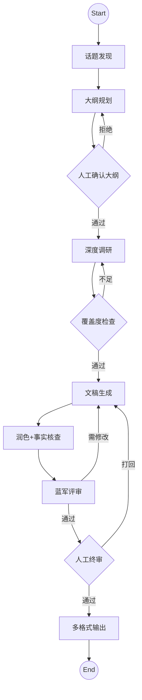

# LangGraph 内容生产流水线 — 各环节方案

> 基于 `01-product/stage/` PRD v5.0 设计 + 方法论注入改进  
> 对应代码: `api/src/langgraph/`

## 流水线总览



## 阶段 × 节点映射

| PRD 阶段 | LangGraph 节点 | 文档 |
|----------|---------------|------|
| Stage 1: 选题策划 | `TOPIC_DISCOVER` → `PLANNER` → `HUMAN_OUTLINE` | [Stage1-Topic-Planning.md](Stage1-Topic-Planning.md) |
| Stage 2: 深度研究 | `RESEARCHER` (多轮迭代) | [Stage2-Deep-Research.md](Stage2-Deep-Research.md) |
| Stage 3: 文稿生成 | `WRITER` → `POLISH` | [Stage3-Content-Generation.md](Stage3-Content-Generation.md) |
| Stage 4: 质量评审 | `BLUE_TEAM` → `HUMAN_APPROVE` | [Stage4-Quality-Review.md](Stage4-Quality-Review.md) |
| Stage 5: 多格式输出 | `OUTPUT` (Markdown/HTML/PDF) | [Stage5-Output-Generation.md](Stage5-Output-Generation.md) |

## 与当前实现的差异

| 维度 | 当前 LangGraph (7节点) | 新方案 (10节点) |
|------|----------------------|----------------|
| 话题发现 | 无 | 新增 `TOPIC_DISCOVER` 节点 |
| 大纲生成 | 固定三层模板 | 内容驱动（已改造 planner.ts） |
| 调研 | 一步到底 | 多轮迭代 + 覆盖度检查（已改造 researcher.ts） |
| 写作 | 单次生成 | 分段生成 + 润色 + 事实核查 |
| 评审 | 轻量模拟 | 串行5轮（3 AI + 2 CDT专家） |
| 输出 | 仅 Markdown | Markdown + HTML + PDF |

## State Schema 扩展

```typescript
// 新增状态字段（在现有 PipelineState 基础上）
hotTopics: HotTopic[];           // 话题发现结果
coverageReport: CoverageReport;  // 调研覆盖度
factCheckReport: FactCheckResult[];  // 事实核查
polishedDraft: string;           // 润色后稿件
outputFormats: string[];         // 目标格式 ['markdown','html','pdf']
outputFiles: OutputFile[];       // 生成的文件列表
```
