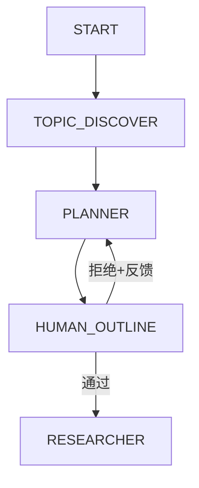

# Stage 1: 选题策划 — LangGraph 方案

> 对应 PRD: `01-product/stage/PRD-Stage1-Topic-Planning-v5.1.md`  
> 对应代码: `api/src/agents/planner.ts`, `api/src/langgraph/nodes.ts`

## 节点拆分

PRD Stage 1 拆为 3 个 LangGraph 节点：



### 节点 1: TOPIC_DISCOVER — 多源话题发现

**PRD 对应**: 数据源层 + 质量评估 + 热度验证 + 竞品分析 + 评分排序

**输入**: 触发信号（定时 / 手动 / 指定话题）

**处理逻辑**:
1. 多源并行抓取（RSS + Web Search + 社区 + 热搜）
2. 话题归并（实体链接 + SimHash 去重）
3. 质量评估（来源权威性 × 内容完整度 → 0-100 分）
4. 热度交叉验证（RSS热度 + 搜索热度 + 社媒情感）
5. 竞品覆盖度分析 + 空白角度发现
6. 多因子加权排序 → Top N 推荐列表

**输出 State**:
```typescript
hotTopics: Array<{
  id: string;
  title: string;
  heatScore: number;
  qualityScore: number;
  differentiationScore: number;
  recommendedAngles: string[];
  gaps: string[];
}>;
```

**当前状态**: PRD 已详细设计，但 LangGraph 未实现此节点。当前流程跳过话题发现，直接接收用户输入的 topic。

**实现建议**: 可作为可选前置节点。用户直接输入话题时跳过此节点。

---

### 节点 2: PLANNER — 内容驱动的大纲规划

**PRD 对应**: 大纲生成 + 数据需求分析

**输入**: `topic`, `context`, `hotTopics`(可选)

**处理逻辑**（已改造，见 `planner.ts`）:
1. **知识库洞察** — 查询历史任务/资产，生成 3-5 个趋势/空白/演变洞见
2. **新角度生成** — 基于洞察提出 2-3 个差异化研究角度
3. **内容驱动大纲** — 话题解构 → 结构推导 → 章节展开
   - 每章包含: coreQuestion, analysisApproach, hypothesis, dataNeeds, visualizationPlan
   - 不套固定模板，从话题核心问题推导结构
   - 分析框架作为推导工具（SWOT/Porter/STP/BCG 等按需选择）

**输出 State**:
```typescript
outline: {
  sections: OutlineSection[];  // 含 coreQuestion, analysisApproach, dataNeeds 等
  knowledgeInsights: KnowledgeInsight[];
  novelAngles: NovelAngle[];
  dataRequirements: DataRequirement[];  // 从 dataNeeds 提取，向后兼容
};
evaluation: EvaluationData;
competitorAnalysis: any;
```

**与 PRD 差异**:
- PRD 使用固定"三层穿透"（宏观→中观→微观）
- 新方案改为内容驱动——结构从话题核心问题推导，不同话题产生不同结构
- 数据需求内嵌章节（含搜索关键词），不再单独生成

---

### 节点 3: HUMAN_OUTLINE — 大纲确认（中断点）

**PRD 对应**: 用户确认大纲

**机制**: LangGraph `interrupt()` 实现 human-in-the-loop

**用户操作**:
- **通过** → 进入 RESEARCHER
- **拒绝 + 反馈** → 回到 PLANNER（反馈作为 `comments` 传入）
- **手动编辑** → 用户直接修改大纲结构后确认

**输出 State**:
```typescript
outlineApproved: boolean;
outlineFeedback?: string;
```
