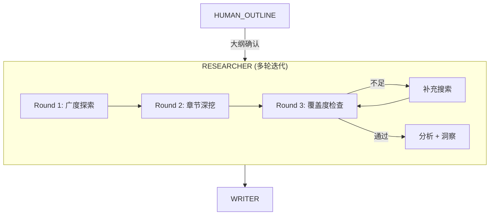

# Stage 2: 深度调研 — LangGraph 方案

> 对应 PRD: `01-product/stage/PRD-Stage2-Deep-Research-v5.0.md`  
> 对应代码: `api/src/agents/researcher.ts`, `api/src/langgraph/nodes.ts`

## 节点设计

PRD Stage 2 映射为 1 个主节点 + 内部多轮迭代：



### 节点: RESEARCHER — 多轮迭代调研

**PRD 对应**: 数据采集 → 数据清洗 → 数据分析 → 洞察提炼 → 保存

**输入**: `topic`, `outline`(含 dataNeeds + searchKeywords), `searchConfig`

**处理逻辑**（已改造，见 `researcher.ts`）:

#### Round 1: 广度探索
- 内容库: topic 全局向量检索
- 网页: 广度关键词（趋势、概况、研究报告）
- 目的: 建立话题全貌理解

#### Round 2: 章节级深挖
- 遍历大纲每个章节:
  - 内容库: 用章节 `coreQuestion` 做向量检索（不是 topic）
  - 网页: 使用章节 `dataNeeds.searchKeywords`（大纲规划好的搜索词）
- 搜索词优先级: 大纲 searchKeywords > 章节问题 > topic+title 拼接

#### Round 3: 覆盖度检查 + 补充
- 按章节 P0 数据需求逐一验证覆盖度
- 不足则生成补充搜索词，额外搜索一轮
- P0 缺失数据标记为 `⚠️ 数据缺失`（不编造假数据）

#### 分析 + 洞察
- 过滤掉缺失标记，只分析真实数据
- 生成 4-6 个洞察（异常/因果/趋势/行动）

**输出 State**:
```typescript
researchData: {
  dataPackage: CleanData[];      // 含 forSection 标记属于哪个章节
  analysis: AnalysisResult;
  insights: Insight[];
};
coverageReport: {
  passed: boolean;
  totalSections: number;
  coveredSections: number;
  gaps: Array<{ section: string; missingMetrics: string[] }>;
  missingData: Array<{ section: string; metric: string; priority: string }>;
};
```

**与 PRD 差异**:

| PRD 设计 | LangGraph 方案 |
|---------|---------------|
| 一步到底的线性流程 | 三轮迭代（广度→深挖→补充） |
| topic 全局检索内容库 1 次 | 每个章节用 coreQuestion 独立检索 |
| 数据不足时无处理 | 覆盖度检查 + 补充搜索 + 缺失标记 |
| SimHash 去重 | URL + 内容前缀去重 |
| 搜索词由 topic+title 拼接 | 来自大纲 dataNeeds.searchKeywords |

**PRD 中未实现的能力**（待后续补充）:
- 数据清洗步骤（SimHash 去重、异常值检测、单位标准化）
- News API 数据源
- 描述统计/回归/聚类等高级分析
