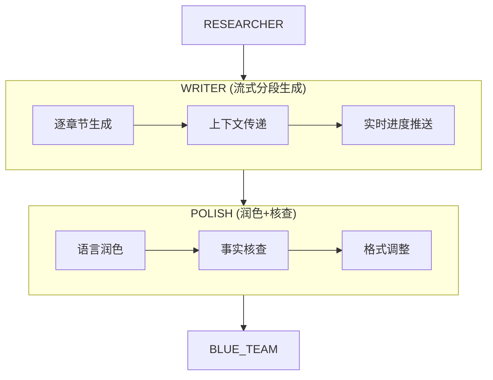

# Stage 3: 文稿生成 — LangGraph 方案

> 对应 PRD: `01-product/stage/PRD-Stage3-Content-Generation-v5.0.md`  
> 对应代码: `api/src/langgraph/nodes.ts` (writerNode)

## 节点设计

PRD Stage 3 拆为 2 个 LangGraph 节点：



### 节点 1: WRITER — 流式初稿生成

**PRD 对应**: 步骤 1 - 流式初稿生成

**输入**: `outline`(含 analysisApproach, coreQuestion), `researchData`, `coverageReport`

**处理逻辑**:
1. 按大纲章节顺序，逐章生成内容
2. 每章利用:
   - `coreQuestion` 确定章节要回答什么
   - `analysisApproach` 指导分析方法
   - `hypothesis` 提供待验证的假设
   - `researchData` 中按 `forSection` 筛选该章节的数据
3. 上下文传递: 每章生成时携带前文摘要
4. 实时进度推送（WebSocket/SSE）:
   - 当前章节索引/标题
   - 已生成字数 / 预估总字数
   - 段落状态: pending/processing/done

**写作 prompt 增强**（结合 consulting-analysis 方法论）:
```
每个章节遵循 "视觉锚点 → 数据对比 → 综合分析" 流程:
1. 引用图表或数据表作为视觉锚点
2. 构建对比表格突出关键指标差异
3. 分析叙事: What(现象) → Why(原因) → So What(启示)
4. 每节结尾至少200字综合分析段
5. 所有数据必须来自 researchData，不编造
```

**输出 State**:
```typescript
draftContent: string;            // 初稿 markdown
draftVersion: number;            // 版本号
```

**DB 写入**: `draft_versions` 表 + `tasks.draft_content`

---

### 节点 2: POLISH — 润色 + 事实核查

**PRD 对应**: 步骤 2(内容润色) + 步骤 3(事实核查) + 步骤 4(格式调整)

**输入**: `draftContent`, `researchData`

**处理逻辑**:

#### Step A: 语言润色
- 语言流畅度优化
- 风格统一（McKinsey/BCG 咨询风格）
- 可读性提升
- 术语校准

#### Step B: 事实核查
- 提取稿件中的数据点（数字、百分比、引用）
- 与 `researchData.dataPackage` 交叉验证
- 标记未验证数据点（可信度 A/B/C/D 分级）
- 生成事实核查报告

#### Step C: 格式调整
- 排版规范化（标题层级、段落间距）
- 图表占位标记（基于大纲 visualizationPlan）
- 引用格式（GB/T 7714 / Markdown 链接）
- 数字格式（千位分隔符）

**输出 State**:
```typescript
polishedDraft: string;           // 润色后稿件
factCheckReport: Array<{
  claim: string;                 // 数据点原文
  location: string;              // 位置（章节+段落）
  verified: boolean;             // 是否验证通过
  credibility: 'A' | 'B' | 'C' | 'D';
  sources: string[];             // 验证来源
}>;
```

**与当前实现的差异**:

| 当前 LangGraph | 新方案 |
|---------------|--------|
| writerNode 单次 LLM 生成 | 分段生成 + 上下文传递 |
| 无润色步骤 | 独立 POLISH 节点 |
| 无事实核查 | 数据点提取 + 交叉验证 |
| 无格式标准化 | 咨询报告格式规范 |
| 无写作方法论 | What→Why→So What 叙事链 |
