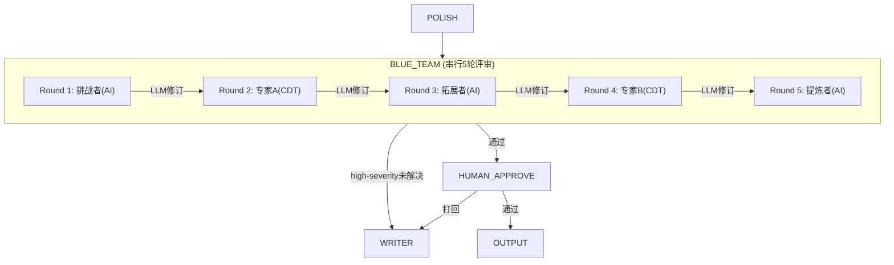

# Stage 4: 质量评审 — LangGraph 方案

> 对应 PRD: `01-product/stage/PRD-Stage4-Quality-Review-v5.0.md`  
> 对应代码: `api/src/services/sequentialReview.ts`, `api/src/langgraph/nodes.ts` (blueTeamNode)

## 节点设计

PRD Stage 4 映射为 2 个 LangGraph 节点 + 循环边：



### 节点 1: BLUE_TEAM — 串行多轮评审

**PRD 对应**: 步骤 1(事实核查) + 步骤 2(逻辑检查) + 步骤 3(专家评审) + 步骤 4(读者测试)

**输入**: `polishedDraft`, `factCheckReport`, `outline`, `topic`

**评审队列**（PRD 定义的专家组合）:

| 轮次 | 类型 | 角色 | 关注点 |
|------|------|------|--------|
| 1 | AI | 挑战者 (Challenger) | 逻辑漏洞、论证跳跃、数据可靠性、隐含假设 |
| 2 | 人类CDT | 领域专家A | 按话题匹配的专家（从 132 位专家库中选取） |
| 3 | AI | 拓展者 (Expander) | 关联因素、国际对比、交叉学科、长尾效应 |
| 4 | 人类CDT | 领域专家B | 按话题匹配的第二位专家 |
| 5 | AI | 提炼者 (Synthesizer) | 核心论点、结构优化、金句提炼、消除冗余 |

**每轮处理流程**:
1. 获取当前版本 Draft
2. 分配给当前轮次评审专家
3. 专家提交评审意见（问题 + 严重性 + 建议）
4. LLM 基于 Draft + 专家意见 + FactCheck 生成新版本
5. 新版本作为下一轮输入

**分轮评审焦点**（逐轮递进）:
- Round 1-2: 结构性问题（框架、逻辑、数据缺口）
- Round 3-4: 细节完整性（数据准确、表述精确）
- Round 5: 整体优化（可读性、专业性、金句）

**严重性分级**:
- 🔴 `high`: 必须修改（事实错误、逻辑矛盾、严重遗漏）
- 🟡 `medium`: 建议修改（表述不清、数据待补、结构可优化）
- 🟢 `praise`: 亮点标记（优秀分析、精彩表述）

**输出 State**:
```typescript
blueTeamRounds: Array<{
  round: number;
  expertName: string;
  expertRole: string;
  expertType: 'ai' | 'human_cdt';
  questions: Array<{
    location: string;
    issue: string;
    severity: 'high' | 'medium' | 'praise';
    suggestion: string;
    rationale: string;
  }>;
  revisionContent: string;
  revisionSummary: string;
}>;
currentReviewRound: number;
reviewPassed: boolean;
```

**循环条件**:
```typescript
// blue_team → writer (需要打回重写)
if (currentReviewRound < maxReviewRounds && !reviewPassed) → WRITER

// blue_team → human_approve (评审通过 或 达到最大轮次)
else → HUMAN_APPROVE
```

---

### 节点 2: HUMAN_APPROVE — 人工终审

**PRD 对应**: 步骤 6 - 人工确认

**机制**: LangGraph `interrupt()` 实现

**展示给用户**:
- 终稿内容
- 各轮评审摘要（问题数、严重性分布）
- 事实核查报告
- 覆盖度报告
- 质量评分

**用户操作**:
- **接受** → 进入 OUTPUT
- **打回修改** + 反馈 → 回到 WRITER（反馈作为修改指导）
- **拒绝** → 流程终止

**输出 State**:
```typescript
finalApproved: boolean;
approvalFeedback?: string;
```

**与当前实现的差异**:

| 当前 LangGraph blueTeamNode | 新方案 |
|----------------------------|--------|
| 轻量模拟 3 个 AI 角色 | 完整 5 轮串行（3 AI + 2 CDT 人类专家） |
| 直接 LLMRouter 生成评审 | 接入 sequentialReview.ts + expert-library |
| 无分轮焦点 | 逐轮递进（结构→细节→优化） |
| 无实时流式 | WebSocket 实时推送评审进度 |
| 无事实核查集成 | 融合 factCheckReport 到评审 |
| max 2 轮循环 | 5 轮内置 + 可配置打回重写 |
