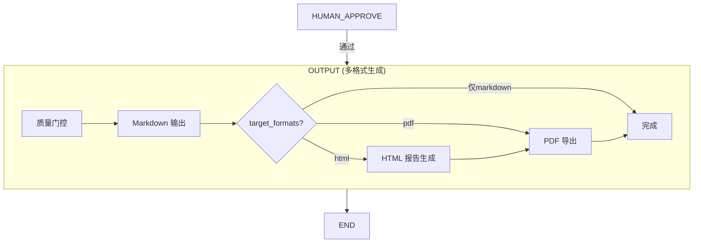

# Stage 5: 多格式输出 — LangGraph 方案

> 原 PRD 未单独定义此阶段（输出仅为 pipeline.ts 末尾的 markdown 写入）  
> 本方案新增为独立阶段，支持 Markdown → HTML → PDF 多格式输出

## 节点设计



### 节点: OUTPUT — 多格式输出生成

**输入**: `polishedDraft`(终稿), `outline`, `factCheckReport`, `targetFormats`

**处理逻辑**:

#### Step 1: 质量门控
- 检查 `review_reports` 的 decision（reject 则阻塞）
- 确认终稿非空且达到最低字数

#### Step 2: Markdown 输出（始终生成）
- 终稿直接作为 markdown 格式保存到 `outputs` 表

#### Step 3: HTML 报告生成（当 target_formats 含 'html'）

**方案**: Markdown → 带样式 HTML

**技术选型**:
- `marked` 库: Markdown → HTML 转换
- 内嵌 CSS: 咨询报告风格模板

**HTML 模板结构**:
```html
<!DOCTYPE html>
<html lang="zh-CN">
<head>
  <meta charset="UTF-8">
  <title>{报告标题}</title>
  <style>
    /* 咨询报告 CSS — 打印优化 */
    @page { size: A4; margin: 2.5cm; }
    body { font-family: 'Source Han Serif', 'Noto Serif CJK', serif; }
    h1 { font-size: 24pt; border-bottom: 3px solid #1a365d; }
    h2 { font-size: 16pt; color: #1a365d; margin-top: 2em; }
    table { width: 100%; border-collapse: collapse; }
    th { background: #1a365d; color: white; padding: 8px; }
    td { border: 1px solid #e2e8f0; padding: 8px; }
    blockquote { border-left: 4px solid #3182ce; padding-left: 16px; color: #4a5568; }
    .cover { text-align: center; page-break-after: always; padding-top: 30vh; }
    .toc { page-break-after: always; }
    @media print { .no-print { display: none; } }
  </style>
</head>
<body>
  <div class="cover">
    <h1>{标题}</h1>
    <p>{日期} | {受众}</p>
  </div>
  <div class="toc">{目录}</div>
  <div class="content">{正文 HTML}</div>
  <div class="references">{参考文献}</div>
</body>
</html>
```

**HTML 增强**:
- 自动生成目录（从 h2/h3 提取）
- 封面页（标题 + 日期 + 受众）
- 图表占位符渲染（基于 visualizationPlan）
- 数据表格自动美化
- 事实核查标注（未验证数据高亮）
- 打印优化（A4 分页、页边距）

#### Step 4: PDF 导出（当 target_formats 含 'pdf'）

**方案**: HTML → PDF

**技术选型** (按优先级):
1. **Puppeteer** — 最可靠，Chrome 渲染保真度高
   ```typescript
   import puppeteer from 'puppeteer';
   const browser = await puppeteer.launch({ headless: true });
   const page = await browser.newPage();
   await page.setContent(htmlContent, { waitUntil: 'networkidle0' });
   const pdf = await page.pdf({
     format: 'A4',
     margin: { top: '2.5cm', bottom: '2.5cm', left: '2cm', right: '2cm' },
     printBackground: true,
   });
   ```

2. **浏览器端 Print-to-PDF** — 零后端依赖，让前端触发 `window.print()`
   - 提供 `/api/v1/outputs/:id/html` 端点
   - 前端打开 HTML → 浏览器 Print → 保存 PDF

**输出 State**:
```typescript
outputFiles: Array<{
  id: string;
  format: 'markdown' | 'html' | 'pdf';
  filePath?: string;       // PDF 文件路径
  content?: string;        // Markdown/HTML 内容
  createdAt: Date;
}>;
```

**DB 写入**: 每种格式各一条记录到 `outputs` 表

---

## 与当前实现的差异

| 当前 outputNode | 新方案 |
|----------------|--------|
| 仅 markdown 写入 | Markdown + HTML + PDF 三格式 |
| 忽略 target_formats | 按 target_formats 条件生成 |
| 无模板样式 | 咨询报告 CSS 模板 |
| 无 PDF 能力 | Puppeteer 或浏览器端导出 |
| 无封面/目录 | 自动封面 + 目录生成 |

## 实现路径

| 步骤 | 工作量 | 依赖 |
|------|--------|------|
| 1. 安装 `marked` + 创建 HTML 模板 | 小 | 无 |
| 2. 改造 `generateOutput()` 按 target_formats 生成 | 中 | Step 1 |
| 3. 添加 HTML 下载端点 | 小 | Step 2 |
| 4. 集成 Puppeteer 生成 PDF | 中 | Step 2 |
| 5. 添加 PDF 下载端点 | 小 | Step 4 |
