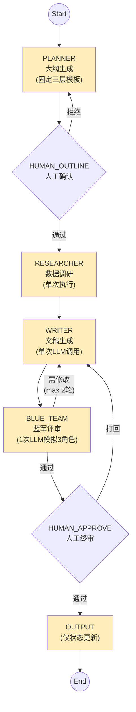
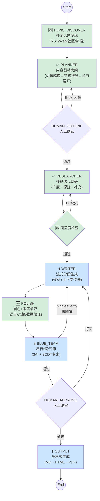

# LangGraph 流水线升级评估报告

> 前后方案的流程架构对比 + 能力覆盖度评估  
> 日期: 2026-04-09

---

## 一、流程架构总览对比

### 1.1 当前方案（7 节点）



**特征**：线性串行、无迭代、无质量门控、单格式输出

---

### 1.2 新方案（10 节点）



**特征**：多轮迭代、质量门控、专家评审、多格式输出

---

## 二、逐节点架构升级对比

### 2.1 选题策划阶段

```
【当前】                              【新方案】
                                      ┌─────────────────────────┐
                                      │ TOPIC_DISCOVER (🆕)     │
                                      │  RSS聚合 ──┐            │
                                      │  Web搜索 ──┤→ 话题归并  │
                                      │  社区抓取 ──┤→ 质量评估  │
                                      │  热搜聚合 ──┘→ 竞品分析  │
                                      │         → 评分排序      │
                                      └────────────┬────────────┘
                                                   ↓
┌─────────────────────────┐           ┌─────────────────────────┐
│ PLANNER                 │           │ PLANNER (✅ 已改造)      │
│  固定"三层穿透"模板     │           │  Step1: 话题解构         │
│  宏观→中观→微观         │    →      │    核心实体/张力/问题    │
│  洞察仅"融入"           │           │  Step2: 结构推导         │
│  数据需求事后独立生成   │           │    从问题生长，非套模板  │
│                         │           │  Step3: 章节展开         │
│  输出: {title,content}  │           │    含coreQuestion/       │
│                         │           │    analysisApproach/     │
│                         │           │    dataNeeds+搜索关键词/ │
│                         │           │    visualizationPlan     │
└─────────────────────────┘           └─────────────────────────┘
```

| 维度 | 当前 | 新方案 | 状态 |
|------|------|--------|------|
| 话题发现 | 无（用户手动输入） | 多源自动发现 + 评分排序 | 🆕 待实现 |
| 大纲结构 | 固定宏观→中观→微观 | 从话题问题推导，领域自适应 | ✅ 已改造 |
| 分析框架 | 无 | SWOT/Porter/STP/BCG 等按需选择 | ✅ 已改造 |
| 数据需求 | 事后独立生成，泛泛描述 | 内嵌章节，含可执行搜索关键词 | ✅ 已改造 |
| 可视化规划 | 无 | 每章含 chartType + dataMapping | ✅ 已改造 |

---

### 2.2 深度调研阶段

```
【当前】                              【新方案】

┌─────────────────────────┐           ┌─────────────────────────┐
│ RESEARCHER (单次执行)    │           │ RESEARCHER (多轮迭代)    │
│                         │           │                         │
│  topic全局检索(1次)──┐  │           │  Round 1: 广度探索       │
│  Web搜索(10条)   ────┤  │           │    topic全局检索(库+网)  │
│  拼接query        ───┤  │    →      │         ↓               │
│  LLM编造假数据   ────┤  │           │  Round 2: 章节深挖       │
│  一步到底         ───┘  │           │    每章用coreQuestion    │
│                         │           │    检索 + searchKeywords │
│  无覆盖度检查           │           │         ↓               │
│  无质量门控             │           │  Round 3: 覆盖度检查     │
│                         │           │    P0需求逐一验证 ──┐   │
│                         │           │    不足→补充搜索  ←─┘   │
│                         │           │    缺失→标记(不造假)    │
└─────────────────────────┘           └─────────────────────────┘
```

| 维度 | 当前 | 新方案 | 状态 |
|------|------|--------|------|
| 执行轮次 | 1 轮 | 3 轮迭代（广度→深挖→补充） | ✅ 已改造 |
| 内容库检索 | topic 全局 1 次 top 10 | 每章用 coreQuestion 独立检索 | ✅ 已改造 |
| 搜索词生成 | topic+title 拼接，max 10 | 大纲 searchKeywords 优先，20-30 | ✅ 已改造 |
| 数据缺失 | LLM 编造假数据 | 标记缺失，不造假 | ✅ 已改造 |
| 覆盖度检查 | 无 | 按 P0 需求验证，不足则补充 | ✅ 已改造 |
| 数据清洗 | 无 | SimHash 去重/格式化/标准化 | ⬜ 待实现 |

---

### 2.3 文稿生成阶段

```
【当前】                              【新方案】

┌─────────────────────────┐           ┌─────────────────────────┐
│ WRITER                   │           │ WRITER (流式分段)        │
│  单次LLM调用            │           │  逐章节生成              │
│  一次性输出全文          │    →      │  上下文传递              │
│  无方法论约束           │           │  What→Why→So What叙事链  │
│  无润色                 │           │  实时进度推送(SSE)       │
│  无事实核查             │           └────────────┬────────────┘
│  无格式标准化           │                        ↓
│                         │           ┌─────────────────────────┐
│                         │           │ POLISH (🆕)              │
│                         │           │  Step A: 语言润色        │
│                         │           │    流畅度/风格/可读性    │
│                         │           │  Step B: 事实核查        │
│                         │           │    数据点提取→交叉验证  │
│                         │           │    可信度分级(A/B/C/D)   │
│                         │           │  Step C: 格式调整        │
│                         │           │    排版/引用/图表占位    │
└─────────────────────────┘           └─────────────────────────┘
```

| 维度 | 当前 | 新方案 | 状态 |
|------|------|--------|------|
| 生成方式 | 单次 LLM 调用 | 逐章节流式分段 | ⬆️ 待实现 |
| 写作方法论 | 无约束 | What→Why→So What + 视觉锚点 | ⬆️ 待实现 |
| 润色 | 无 | 语言/风格/可读性优化 | 🆕 待实现 |
| 事实核查 | 无 | 数据点提取 + 交叉验证 | 🆕 待实现 |
| 格式标准化 | 无 | 咨询报告格式/引用规范 | 🆕 待实现 |
| 进度推送 | 无 | WebSocket/SSE 实时推送 | 🆕 待实现 |

---

### 2.4 质量评审阶段

```
【当前】                              【新方案】

┌─────────────────────────┐           ┌─────────────────────────┐
│ BLUE_TEAM                │           │ BLUE_TEAM (串行5轮)      │
│  1次LLM调用             │           │                         │
│  模拟3角色(同一prompt)  │    →      │  R1 挑战者(AI)           │
│  max 2轮循环            │           │    ↓ LLM修订             │
│  无真人专家             │           │  R2 专家A(CDT人格)       │
│  无分轮焦点             │           │    ↓ LLM修订             │
│  无事实核查集成         │           │  R3 拓展者(AI)           │
│  无读者测试             │           │    ↓ LLM修订             │
│                         │           │  R4 专家B(CDT人格)       │
│                         │           │    ↓ LLM修订             │
│                         │           │  R5 提炼者(AI)           │
│                         │           │                         │
│                         │           │  分轮焦点:              │
│                         │           │  R1-2 结构→R3-4 细节    │
│                         │           │  →R5 整体优化           │
└─────────────────────────┘           └─────────────────────────┘
```

| 维度 | 当前 | 新方案 | 状态 |
|------|------|--------|------|
| 评审方式 | 1 次 LLM 模拟 3 角色 | 5 轮串行，每轮独立调用 | ⬆️ 待实现 |
| 专家类型 | 仅 AI 模拟 | 3 AI + 2 CDT 人类专家 | ⬆️ 待实现 |
| 分轮焦点 | 无 | 结构→细节→优化 递进 | 🆕 待实现 |
| 逻辑检查 | 无 | 论证完整性/一致性/因果关系 | 🆕 待实现 |
| 读者测试 | 无 | 可读性/受众匹配/满意度 | 🆕 待实现 |
| 实时推送 | 无 | WebSocket 评审进度推送 | 🆕 待实现 |

---

### 2.5 输出阶段

```
【当前】                              【新方案】

┌─────────────────────────┐           ┌─────────────────────────┐
│ OUTPUT                   │           │ OUTPUT (多格式)          │
│  更新status=completed   │    →      │  质量门控               │
│  更新progress=100       │           │     ↓                   │
│  仅状态更新             │           │  Markdown 输出(始终)     │
│  无实际文件生成         │           │     ↓                   │
│  忽略target_formats     │           │  HTML报告(按需)          │
│                         │           │    marked转换+CSS模板   │
│                         │           │    封面+目录+正文        │
│                         │           │     ↓                   │
│                         │           │  PDF导出(按需)           │
│                         │           │    Puppeteer / 浏览器    │
└─────────────────────────┘           └─────────────────────────┘
```

| 维度 | 当前 | 新方案 | 状态 |
|------|------|--------|------|
| 输出格式 | 仅状态更新（无实际文件） | Markdown + HTML + PDF | ⬆️ 待实现 |
| 质量门控 | 有（review decision） | 保留 | ✅ 已有 |
| HTML 模板 | 无 | 咨询报告 CSS + 封面 + 目录 | 🆕 待实现 |
| PDF 能力 | 无 | Puppeteer 或浏览器端 | 🆕 待实现 |

---

## 三、能力覆盖度评估

### 3.1 PRD 功能覆盖率

| 阶段 | PRD 定义的能力步骤 | 当前覆盖 | 新方案覆盖 | 提升 |
|------|-------------------|---------|-----------|------|
| Stage 1: 选题 | 6 步 | 1/6 (17%) | 3/6 (50%) | +33% |
| Stage 2: 调研 | 5 步 | 1/5 (20%) | 4/5 (80%) | +60% |
| Stage 3: 写作 | 4 步 | 1/4 (25%) | 3/4 (75%) | +50% |
| Stage 4: 评审 | 6 步 | 2/6 (33%) | 4/6 (67%) | +34% |
| Stage 5: 输出 | 3 步 | 0/3 (0%)  | 3/3 (100%) | +100% |
| **总计** | **24 步** | **5/24 (21%)** | **17/24 (71%)** | **+50%** |

### 3.2 已完成 vs 待实现

```
已完成 (代码已改造):
  ✅ PLANNER — 内容驱动大纲 (planner.ts)
  ✅ RESEARCHER — 多轮迭代调研 (researcher.ts)
  ✅ OutlineSection 类型扩展 (types/index.ts)
  ✅ LangGraph 方案文档 (01-product/LangGraph/)

待实现 (方案已设计，代码未写):
  🆕 TOPIC_DISCOVER — 多源话题发现
  🆕 POLISH — 润色 + 事实核查
  ⬆️ WRITER — 流式分段生成
  ⬆️ BLUE_TEAM — 串行5轮真实评审
  ⬆️ OUTPUT — HTML/PDF 多格式
  🆕 数据清洗 — SimHash 去重 + 标准化

未规划:
  ⬜ 读者测试 (Stage 4 Step 4)
  ⬜ RSS 定时抓取基础设施
  ⬜ 社区抓取 (小红书/微博/知乎)
```

---

## 四、升级优先级建议

| 优先级 | 节点 | 理由 | 工作量 |
|--------|------|------|--------|
| **P0** | WRITER 流式分段 | 用户体验核心——实时看到内容生成 | 中 |
| **P0** | OUTPUT HTML+PDF | 用户直接可见的交付物升级 | 中 |
| **P1** | POLISH 润色+核查 | 内容质量的关键保障 | 中 |
| **P1** | BLUE_TEAM 串行评审 | 已有 sequentialReview.ts，需接入 LangGraph | 中 |
| **P2** | TOPIC_DISCOVER | 自动化选题，降低人工成本 | 大 |
| **P2** | 数据清洗管线 | 调研数据质量提升 | 中 |
| **P3** | 读者测试 | 锦上添花 | 小 |
