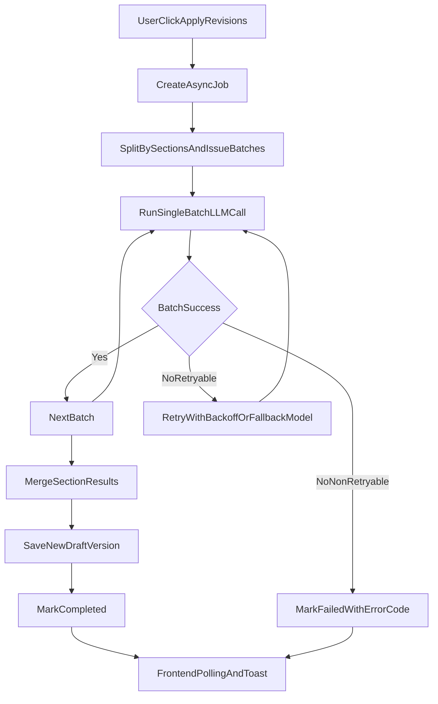

# 一键改稿超时治理计划

## 目标
- 显著降低 `apply-revisions` 的超时率与长尾耗时。
- 确保任务状态可收敛（不再长期停留 `doing`）。
- 让用户能区分“超时”与“业务校验错误”，并可安全重试。

## 现状锚点（基于当前实现）
- 后端批量改稿主链路在 [api/src/services/revisionAgent.ts](/Users/scubiry/Documents/Scubiry/lab/pipeline/api/src/services/revisionAgent.ts)（70% 阶段发起 LLM 改稿）。
- 异步任务状态在 [api/src/services/asyncBatchRevision.ts](/Users/scubiry/Documents/Scubiry/lab/pipeline/api/src/services/asyncBatchRevision.ts)。
- LLM 统一入口在 [api/src/services/llm.ts](/Users/scubiry/Documents/Scubiry/lab/pipeline/api/src/services/llm.ts)。
- 前端轮询与错误提示在 [webapp/src/pages/task-detail/ReviewsTab.tsx](/Users/scubiry/Documents/Scubiry/lab/pipeline/webapp/src/pages/task-detail/ReviewsTab.tsx)。

## 分阶段实施

### Phase 1：稳定性兜底（先止血）
- **任务状态心跳与阶段标记**
  - 在 `asyncBatchRevision` 状态对象增加 `stage`、`lastHeartbeatAt`、`attempt` 字段。
  - 在关键步骤（收集意见、构建 prompt、调用 LLM、保存版本）更新心跳。
- **任务级 watchdog 强化**
  - 现有总超时基础上，增加“无心跳超时”判定（例如 90s 无更新即 fail）。
  - fail 时统一落 `task_logs`，并记录 `stage` 与 `attempt`。
- **错误分类标准化**
  - 在后端返回中增加 `errorCode`（如 `LLM_TIMEOUT`、`NETWORK_TIMEOUT`、`VALIDATION_ERROR`）。

### Phase 2：降低单次调用耗时（核心降超时）
- **分段改稿（章节级）**
  - 从“全稿一次改”升级为“按章节批次改稿 + 最终合并”。
  - 每批建议控制在 3-5 条，减少单次 Prompt 规模。
- **Prompt 裁剪策略**
  - 仅注入目标章节内容与相关建议，不再拼接整稿全文。
  - 保留现有质量守卫（长度比例）并增加章节级守卫。
- **输出上限控制**
  - 章节改稿场景下下调 `maxTokens`，避免模型长输出拖慢。

### Phase 3：可恢复执行与重试
- **有限重试机制**
  - 仅对超时/网络错误执行指数退避重试（最多 2 次）。
  - 对校验错误、内容解析错误不重试。
- **模型降级路径**
  - 主模型超时后自动切换更快模型（同任务类型）。
  - 在日志中明确记录模型切换链路。
- **幂等与断点续跑**
  - 基于 `jobId + stage` 实现安全重入，防止重复创建版本。

### Phase 4：前端体验与运维观测
- **前端状态展示细化**
  - 在 Reviews 页显示阶段级文案（如“正在改第 2/5 章节”）。
  - 超时类错误统一文案：`LLM超时，请重试`；并提供重试动作。
- **指标与日志**
  - 记录并上报：prompt 长度、issues 数、模型、耗时、重试次数、成功率。
  - 形成 P50/P95 观测视图，持续调参。

## 关键改动文件
- 后端
  - [api/src/services/revisionAgent.ts](/Users/scubiry/Documents/Scubiry/lab/pipeline/api/src/services/revisionAgent.ts)
  - [api/src/services/asyncBatchRevision.ts](/Users/scubiry/Documents/Scubiry/lab/pipeline/api/src/services/asyncBatchRevision.ts)
  - [api/src/services/llm.ts](/Users/scubiry/Documents/Scubiry/lab/pipeline/api/src/services/llm.ts)
  - [api/src/routes/production.ts](/Users/scubiry/Documents/Scubiry/lab/pipeline/api/src/routes/production.ts)
- 前端
  - [webapp/src/pages/task-detail/ReviewsTab.tsx](/Users/scubiry/Documents/Scubiry/lab/pipeline/webapp/src/pages/task-detail/ReviewsTab.tsx)
  - [webapp/src/api/client.ts](/Users/scubiry/Documents/Scubiry/lab/pipeline/webapp/src/api/client.ts)

## 数据流（目标态）

## 验收标准
- 任务不会长期停留在 `doing`（watchdog 可收敛）。
- 一键改稿超时率明显下降（按 7 天窗口对比 P95 与失败率）。
- 超时错误与业务错误在 UI 中可清晰区分。
- 重试/降级不引入重复版本与脏数据。
