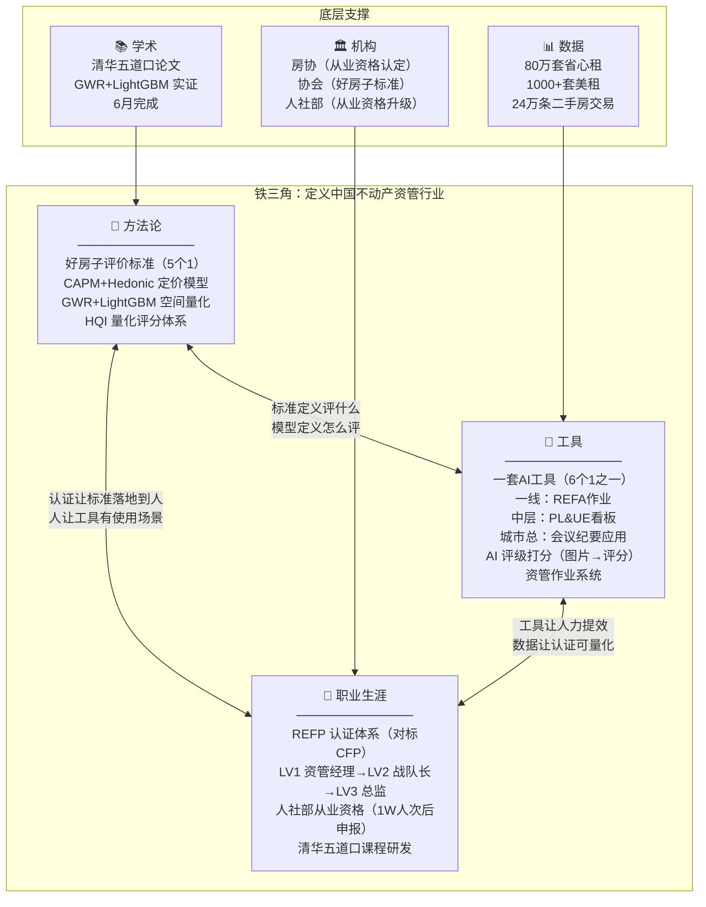
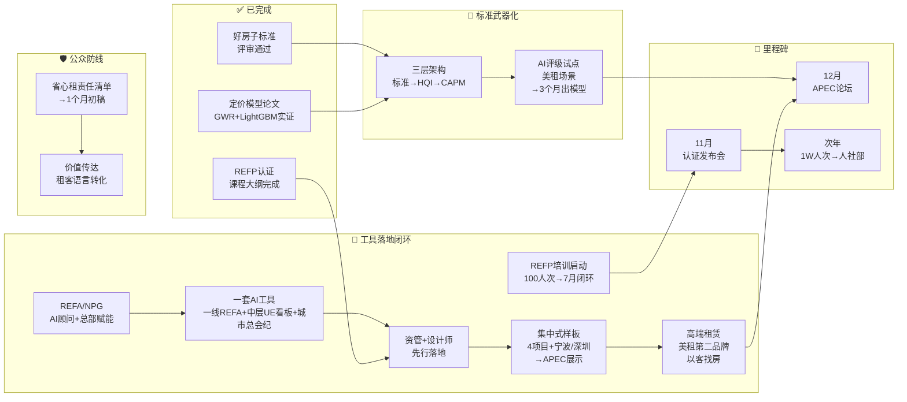
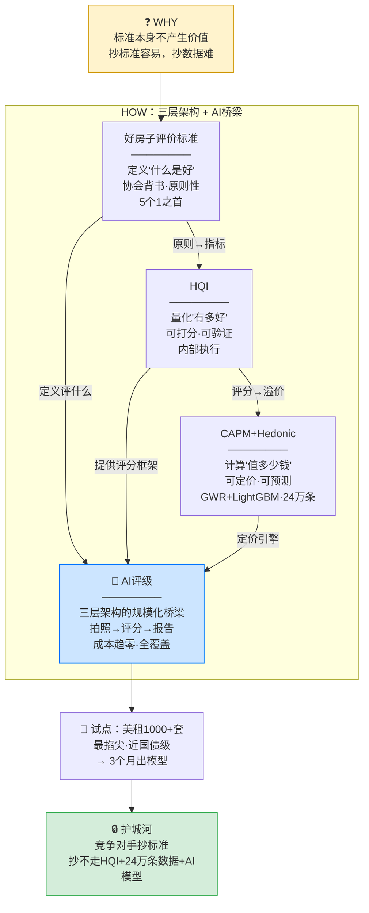
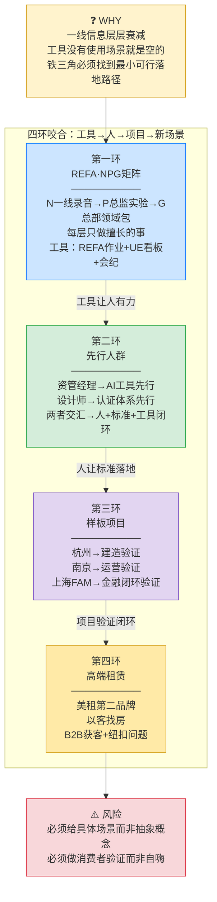
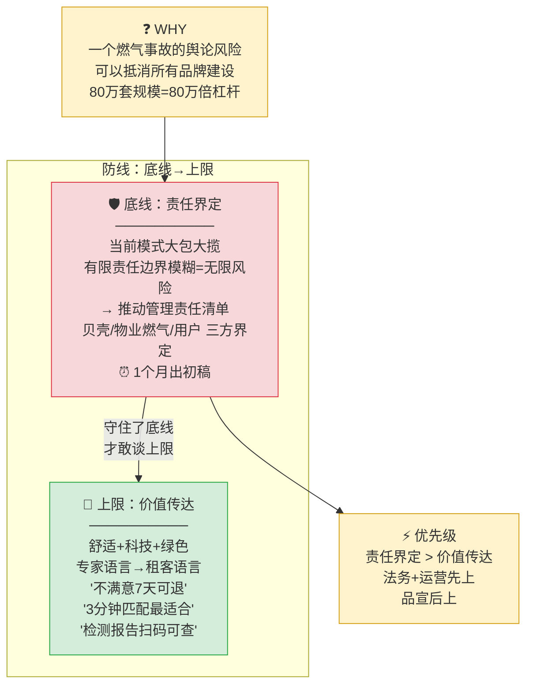

# 租赁好房子 · 评审通过后汇报框架 v2

## 汇报背景

2025年推动的"租赁好房子"行业标准项目，今日与黄老师赴协会完成评审，**已获通过**。

贝壳拿到了住房租赁行业"什么是好房子"的**定义权**——这是行业基础设施级别的战略卡位。

**核心判断**：标准已立，但标准本身不产生价值。必须完成从"纸面标准"到"业务武器"的转化，否则评审通过只是里程碑，不是终点。

### 为什么贝壳必须做这件事？

**一句话**：租赁行业正在从"信息中介"走向"资产管理"，贝壳必须从"收中介费的"变成"定义行业运行方式的"，否则永远困在5%净利率里。

展开三层逻辑：

**第一层：不做，就被别人定义**

评审通过了，但标准本身没有护城河——任何竞争对手都能抄走"舒适+科技+绿色"的定义。**真正不可复制的是三层闭环**：标准(定义好) → HQI(量化好) → CAPM(定价好)。对手抄走标准，抄不走24万条数据训练的定价模型和80万套房源的评分体系。**谁完成闭环，谁就是行业基础设施**；谁没完成，标准就是一张纸。

**第二层：做了，就能从"低毛利中介"升级为"行业操作系统"**

省心租80万套，净利率不到5%——因为贝壳本质上还在做"信息搬运+人力堆叠"。铁三角的逻辑是：
- **方法论**（标准+定价模型）= 让"好"可以被定义和定价 → 不再靠经验拍脑袋
- **工具**（AI+REFA）= 让判断从人力驱动变成数据驱动 → 边际成本趋零
- **职业生涯**（REFP认证）= 让人有动力按标准做事 → 行业人才被锁定在贝壳体系

三个维度咬合，贝壳就从"帮业主找租客的中介"变成**"定义这个行业怎么运转的操作系统"**——标准是规则，工具是引擎，认证是人才护城河。

**第三层：时机窗口非常窄**

- 标准刚通过，行业标准的话语权有时效——别人也在做
- APEC论坛12月，必须拿出实体案例，否则只是纸上谈兵
- 人社部认定需要1W人次认证，早启动一年就早一年拿到国家背书
- AI评级的数据壁垒在快速贬值——竞争对手也在积累数据

**不做=被定义，做了=定义别人，晚做=窗口关闭。**

### 好房子评价标准的"6个1"

| # | 目标 | 合作方 | 状态 |
|---|------|--------|------|
| 1 | 一个行业标准 | 中房协 | ✅ 评审通过 |
| 2 | 一个职业认证 | 人社部 | 🔄 REFP体系设计中，1W人次后申报 |
| 3 | 一个发布会 | 人民日报 | 📋 11月计划中 |
| 4 | 一个白皮书 | 清华 | 📋 论文6月完成 |
| 5 | 一个标杆项目 | — | 🔄 4项目已储备+宁波/深圳对接中 |
| 6 | 一套AI工具 | — | 🔄 REFA一线作业+PL&UE看板+会议纪要 |
## 战略框架：铁三角

**职业生涯 + 方法论（行业标准+定价模型+人社部认定）+ 工具（AI）= 铁三角**

没有方法论，工具是盲的；没有工具，方法是空的；没有认证，人没有动力按标准做事。


## 执行路径图



### 关键时间线

| 时间      | 里程碑                                 | 状态      |
| ------- | ----------------------------------- | ------- |
| 12月（去年） | 组建标准委员会（清华五道口+房协+银行）                | ✅ 完成    |
| 5月（本月）  | 课程研发完成（REFP大纲，对标CFP体系）              | ✅ 完成    |
| 6月      | 定价模型论文完成（CAPM+Hedonic+GWR+LightGBM） | 🔄 进行中  |
| 6月      | 备选认证培训机构确认（清华五道口学院）                 | 🔄 进行中  |
| 7月      | 100人次培训+考试闭环                        | 🎯 下一步  |
| 9月      | 推广到其他企业（平安不动产、上海银行、福州安住）            | 📋 计划中  |
| 11月     | 认证发布会（联合人民日报、新华网）                   | 📋 计划中  |
| 次年12月   | 1W人次认证后 → 申请人社部从业资格                 | 📋 终极目标 |
## 方向一：标准武器化

> 评审通过了，然后呢？标准怎么从"纸面定义"变成"可量化、可定价、可规模化的业务武器"？



### 三层架构：定义好→量化好→定价好

| 层级     | 体系               | 回答     | 性质            | 颗粒度     | 场景            |
| ------ | ---------------- | ------ | ------------- | ------- | ------------- |
| **顶层** | 好房子评价标准（5个1）    | "什么是好" | 行业标准（对外），协会背书 | 原则性、框架性 | APEC论坛、白皮书    |
| **中层** | HQI              | "有多好"  | 内部质量评分（对内）    | 可量化、可打分 | 内部质量管理        |
| **底层** | CAPM+Hedonic定价模型 | "值多少钱" | 学术模型→业务引擎     | 可定价、可预测 | 资管作业系统、业主资产规划 |

竞争对手即使抄了标准，也抄不走HQI的评分体系和24万条数据训练的定价模型。

> 锦江合作会议："除了写定义之外，还是要有认证体系来支撑"——行业标准必须配套可量化的认证体系才有落地价值，HQI+定价模型就是这个量化引擎。

### AI评级：三层架构的规模化桥梁

标准从"专家评价"变成"规模化可执行"，AI评级是关键：

```
传统：专家现场打分 → 成本高、覆盖窄、不可规模化
AI：  拍照上传 → AI识别+评分 → 自动出报告 → 成本趋零、全覆盖
```

- 好房子标准定义**评什么**（舒适+科技+绿色三大维度）
- HQI提供**评分框架**（可量化的打分体系）
- AI评级实现**规模化执行**（拍照→自动评分→出报告）

### 美租场景：AI评级的最佳试点

- 美租1000+套装修房源，省心租大资产中"**最掐尖**"部分，信用风险近国债级
- 已有决策："**行业标准需建立基准锚，如三星房溢价15%、五星溢价30%**"——AI评级为基准锚提供量化验证
- **演示场景**：美租房源上线前拍照 → AI按三维度自动打分 → 评分纳入房源展示 → 租客可直观看到"好房指数"
- **数据壁垒**：80万套省心租+1000+套美租实拍图片+入住后反馈，是训练AI评级模型的**独家数据资产**
- **延伸**：省心租全量房源分级 / 业主定价建议（好房子指数→租金溢价）/ 金融机构风控参考

### CAPM+Hedonic定价模型：让"好"可以定价

| 层面 | 学术模型 | 业务转化 |
|------|---------|---------|
| **特征价格（Hedonic）** | 量化各变量对房价的边际效应 | → 资管经理给业主做定价方案的**底层逻辑** |
| **空间异质性（GWR）** | 同一变量在不同区域影响不同 | → 不同城市的差异化定价策略 |
| **精准预测（LightGBM）** | 融合空间特征的高精度预测 | → 资管作业系统中的**自动定价引擎** |
| **CAPM框架** | 投资回报率=无风险利率+风险溢价 | → 业主资产规划的**ROI计算** |

> ⚠️ 风险：团队对省心租价值主张担心是"一厢情愿"——AI评级如果也停留在"自说自话"层面，会同样踩坑。**必须用外部验证（租客行为数据、复租率、租金溢价）校准AI评分**，不能用内部数据自证。
## 方向二：工具落地闭环

> 铁三角的"工具"维度怎么从概念变现实？先在谁身上用？用什么项目验证？
> 答案是四环咬合：**REFA(NPG)→先行人群(资管+设计师)→样板项目(集中式)→高端租赁**



### 第一环：REFA——解决信息衰减

**核心痛点**（上海/成都反复讨论，通用度0.95）：

> "一线信息经过多层传递后失真严重，决策者必须直接接触业主和经纪人"

```
传统：一线 → 资管 → 总监 → 总部（信息层层衰减）
REFA：一线 → AI实时抓取 → 结构化呈现 → 总部直接触达
```

REFA的核心能力：**AI顾问**（AI代替多层管理者，从一线录音/聊天/业务系统提取结构化信息）+ **总部赋能**（基于AI提炼的一手信息做决策，再精准推送到一线）

### NPG矩阵——REFA的核心模块

REFA不是简单的"AI分析录音"，而是**三层分工的协同系统**：

```
┌─────────────────────────────────────────────────────┐
│                    NPG 矩阵                          │
├──────────┬──────────────────┬───────────────────────┤
│          │ 输入             │ 输出                   │
├──────────┼──────────────────┼───────────────────────┤
│ N 一线   │ 🎙️ 录音          │ 原始业务信号           │
│ (Needs)  │ 一手信息直采      │ 业主对话/诉求/现场实况 │
├──────────┼──────────────────┼───────────────────────┤
│ P 总监   │ 🔄 复盘+做实验    │ 管理判断/策略调整       │
│ (Process)│ 基于AI提炼的信息  │ 验证假设/修正动作      │
├──────────┼──────────────────┼───────────────────────┤
│ G 总部   │ 🔬 研发领域包     │ 标准化工具/方法论输出   │
│ (Global) │ 跨城市数据聚合    │ 知识产品/认证课程素材   │
└──────────┴──────────────────┴───────────────────────┘
```

| 层级 | 角色 | 做什么 | 不做什么 | 界面 |
|------|------|--------|---------|------|
| **N 一线** | 信号采集器 | 录音，完整记录真实业务场景 | 不做分析、不做判断 | 录音→AI转写→结构化提取诉求/痛点/异议 |
| **P 总监** | 实验室 | 基于AI输出做复盘，设计实验验证假设 | 不做原始采集、不做标准产品 | 设计A/B实验→追踪结果→修正策略 |
| **G 总部** | 研发中心 | 聚合多城市数据，研发领域包和标准工具 | 不替一线录音、不替总监做判断 | 数据聚合→提炼知识包→输出认证课程素材 |

**NPG与铁三角的映射**：

```
N 一线录音 ────────────→ 工具（AI）的数据入口
P 总监复盘+实验 ──────→ 方法论（标准/HQI）的迭代引擎
G 总部研发领域包 ─────→ 职业生涯（REFP认证）的课程素材来源
```

**领域包**：总部从N层采集+P层验证的数据中，提炼出不同业务领域（"业主资产规划""租客价值匹配""设计师认证"）的标准化知识包——将一线录音中反复出现的业务模式 + 总监实验验证的策略有效成分，封装为可复制、可培训、可认证的标准化模块。领域包直接成为REFP认证课程素材和AI评级模型的训练数据。

**根本解法**：不是让信息不衰减，而是**让每一层只做自己擅长的事**——一线的价值在于**在场**，总监的价值在于**判断**，总部的价值在于**抽象**。

### 一套AI工具：三层分工的工具映射

NPG矩阵定义了"谁做什么"，AI工具则为每一层提供对应的工具支撑：

| 层级 | 使用者 | AI工具 | 做什么 |
|------|--------|--------|--------|
| **一线** | 资管经理/经纪人 | **REFA作业** | 录音→AI转写→结构化提取，一线只管录音，AI自动提炼业主诉求/痛点/异议 |
| **中层** | 总监/战队长 | **PL&UE看板** | 基于N层信号做复盘，设计A/B实验，追踪UE参数变化，验证假设 |
| **城市总** | 城市总/总部 | **会议纪要应用** | 跨城市数据聚合，提炼领域包，输出标准化工具和认证课程素材 |

**PL&UE看板**是中层的关键工具——参考[美租UE管理系统](https://uebj.meizu.life/)的三层治理架构（L1战略层/L2假设验证层/L3执行层），让总监从"信息搬运工"变成"策略实验者"：
- L1 战略层：P&L反推目标UE，仪表盘三视角（贝壳P&L/业主ROI/供应商成本结构）
- L2 假设验证层：U×E弹性热力图+战略主题看板+对齐机制（Attention Layer）
- L3 执行层：核心UE不变，一线工具随便搞

> 整个AI工具体系的架构参考：[美租UE管理系统 v6.0](https://uebj.meizu.life/)

### 第二环：先行人群——资管+设计师

铁三角不能一步到位，**资管经理和设计师**是最小可行落地场景：

**资管经理** → AI工具先行：
- 痛点：下单常出错，不了解业务细节，靠二三四手信息做判断
- 已有决策："**资管经理必须走分工路线，引入租户管家分担物业交付等事务**"
- REFA的AI顾问首先解决资管经理的**信息不对称** → 下单准确率提升

**设计师** → 认证体系先行：
- 共识度1.00："**如何解决'贝壳美租认证设计师'认证资质与发放权限问题**"
- 设计师需要行业认证 → 好房子标准+人社部认定提供方法论 → AI工具提供评级验证
- "贝壳美租认证设计师"工牌——**认证体系的最小可行产品**

**落地三步**：

```
第一步：资管经理 → AI工具先行
  REFA → AI推送一线信息 → 解决信息衰减

第二步：设计师 → 认证体系先行
  "贝壳美租认证设计师" → 好房子标准考核 → HQI评分

第三步：两者交汇
  资管用AI评级验收设计师装修质量 → 设计师用AI工具获取装修建议
  → "人+标准+工具"闭环
```

### 第三环：集中式样板项目——用真实验证

标准需要"样板间"。集中式项目是**最小可行验证单元**——业主单一可控、数据采集标准化、外部展示效果好。

**已有储备**：

| 项目 | 详情 | 合作模式 | 验证类型 | 状态 |
|------|------|---------|---------|------|
| **杭州萧山·星辉时光城** | 3939间（毛坯90%），国企闲置资产盘活首个项目 | 包干委托运营 | 毛坯→按标准装修（**建造验证**） | 决策会已开 |
| **南京浦口·城市星瀚** | 5+5年委托运营，江北CBD商圈 | 委托运营 | 长期运营中持续评级（**运营验证**） | 方案已完成 |
| **上海虹桥·近铁中心** | 200间，装改1816万，海盐公寓品牌 | **FAM模式** | 装改→信托→回收（**金融闭环验证**） | 方案已完成 |
| **上海·呈元驿大厦** | 上海补充样本 | 待确认 | 补充样本 | 资料已备 |
| **宁波/深圳国企房源** | 宁波北仑城投+深圳国企以旧换新/工抵房 | 对接中 | 扩展验证 | 🔄 对接中 |

> 📎 详见 [[集中式项目支撑材料/集中式项目概览]]

**样板矩阵**：

| 维度 | 杭州星辉时光城 | 南京城市星瀚 | 上海近铁中心 |
|------|--------------|------------|------------|
| **政策卡位** | 闲置资产盘活首个项目（80万方入口） | 保租房政府合作平台（住建部背书） | 城市更新+集体资产保值增值 |
| **合作模式** | 包干委托运营 | 委托运营 | **FAM模式**（装修+运营+金融） |
| **好房子验证** | 毛坯→按标准装修（**建造验证**） | 长期运营中持续评级（**运营验证**） | 装改→信托→回收（**金融闭环验证**） |
| **经济效益** | 6-8%净利率 | 5%+激励 | 年毛利817万，26个月回收 |
| **社会效益** | 国企闲置资产盘活标杆→可复制全省 | 政府保租房平台合作→可复制全国 | 商办转型+就业配套 |
| **铁三角验证** | 方法论（标准落地装修） | 工具（AI评级+数据） | 工具×方法论（FAM=标准+金融闭环） |

**金融闭环**：样板项目同时验证"好房子标准 → 更高租金溢价 → 更优资产质量 → 更低融资成本"的金融逻辑，与美租信托、租金代扣分期天然衔接。

**关键卡位**：APEC平行论坛已承诺——一个行业标准+一场APEC论坛+清华白皮书+分散式和集中式项目。样板项目就是论坛展示的实体案例。

### 三环咬合+第四环

```
第一环              第二环               第三环              第四环
REFA(NPG)          先行人群             样板项目            高端租赁场景
  ↓                  ↓                   ↓                  ↓
AI工具解决         资管用AI工具          杭州毛坯→建造验证    美租做第二品牌
信息衰减           设计师用认证体系       南京运营→运营验证    以客找房新模式
                   最小可行场景          上海FAM→金融闭环     B2B获客+专属客户经理
  ↓                  ↓                   ↓                  ↓
  └──────── 三环咬合 ────────┘          └── 新业务场景验证 ──┘
  工具让人有力 → 人让标准落地 → 项目验证闭环 → 新场景扩展
```

### 第四环：高端租赁——工具落地的新业务场景

5月14日会议已启动高端租赁（1万+月租）业务策略讨论，这是铁三角体系落地的**新场景验证**：

**核心判断**：省心租现有模型无法有效服务1万+月租高端市场——租客拒付中介费，业主承担全部佣金。必须用美租作为**第二品牌/第二曲线**，独立团队、独立定价。

**模式转变**：从"以房找客"转向**"以客找房"**
- 目标客群：企业高管（公司支付住房补贴），B2B获客
- 渠道：与猎头/HR公司合作+客户经理在小红书/私域打造个人IP
- 纽扣问题：什么平台独占价值防止客户经理独立？——专属金融能力+会员权益+圈层资源

**与铁三角的衔接**：
- **方法论**：好房子标准+AI评级为高端房源提供品质认证（"认证设计师"工牌提升信任度）
- **工具**：REFA一线作业→PL&UE看板→会议纪要，全链路支撑高端业务闭环
- **职业生涯**：REFP认证体系中的专属客户经理认证

> 📎 详见 [[feishu-minutes/高端第一次-高端租赁业务发展探讨-DqykwO8f3iLatWk7jA0cEJINnM5]]

> ⚠️ 两个风险：(1) 上海汇聚AI项目中永邦宏观叙事 vs 王丽要求的落地画面感——汇报必须给**具体场景**，如"资管经理每天收到AI推送的3条关键房源状态变化"；(2) 美租scope中开放问题排名第一："消费者心里到底觉得我在买什么"——样板项目必须同步做消费者验证，不能做成"自嗨工程"。

### REFP认证体系

**对标**：CFP（国际金融理财师）

| CFP 课程 | REFP 对应模块 |
|---------|-------------|
| 投资规划 | 不动产投资规划（CAPM+Hedonic定价） |
| 员工福利与退休规划 | 业主资产规划（租vs卖、装vs不装、全款vs分期） |
| 个人税务与遗产筹划 | 不动产税务规划 |
| 个人风险管理与保险规划 | 资产风险对冲 |
| 综合案例分析 | 不动产资产规划综合案例 |

**分层认证**：

| 级别 | 角色 | 规模 | 核心能力 |
|------|------|------|---------|
| LV1 | 资管经理 | 单房 | 收房问题点检查、定价方案 |
| LV2 | 战队长 | 多套房 | 托管&美化收益比较、美化方案 |
| LV3 | 资管总监 | 区域市场 | ROI=CapM(after)-CapM(before) /（托管费+装配成本） |

**核心公式**：`ROI = [CapM(after) - CapM(before)] / (托管费 + 装配成本)` ——整个认证体系的理论根基，直接来自CAPM模型

**考培分离**（学习CFP）：考试由标准委员会组织 / 培训由清华五道口学院完成 / 课程研发持续迭代，社群化运营
## 方向三：公众防线

> 面向公众的独立议题，不能并入铁三角叙事。先守住底线，再谈上限。



### 责任界定（底线·雷区）

当前省心租模式"大包大揽"（含维修/招租/催缴），管理费双向各收10%。一旦出现燃气事故、电器故障致人伤亡等极端事件，**有限责任边界的模糊会让贝壳承担无限风险**。

建议推动制定**"省心租管理责任清单"**：

| 责任归属 | 示例 |
|---------|------|
| **贝壳管理责任** | 招租时效、租金代扣、日常维修响应 |
| **物业/燃气公司责任** | 燃气管道、电梯维保、公共区域安全 |
| **用户自身责任** | 家电使用不当、人为损坏、违规改造 |

> 一个燃气事故的舆论风险可以抵消所有品牌建设。**责任界定比价值传达更紧急。**

### 价值传达（上限）

省心租80万套（全球第一），净利率5%以下——规模大利润薄。团队提炼了五六句价值主张，但担心是"**一厢情愿**"。

"舒适+科技+绿色"需要用**租客语言**而非专家语言传达：

| 支柱 | 专家语言 | 租客语言 |
|------|---------|---------|
| 舒适 | 好房子评价标准达标 | "住进来不满意7天可退" |
| 科技 | AI智能匹配 | "3分钟匹配最适合你的房子" |
| 绿色 | ENF级环保材料 | "装修材料检测报告扫码可查" |
## 请求领导决策

### 必须拍板（4项）

1. **批准2-3个集中式样板项目立项**
   - 优先：宁波/北仑/南京浦口城投已有对接的房源
   - 6个月内完成装修+入住+AI评级验证
   - 作为APEC论坛展示案例

2. **批准AI评级工具在美租场景的试点**
   - 美租1000+套房源为训练集，与好房子三支柱对齐
   - 融合GWR+LightGBM定价模型的特征工程
   - 目标：3个月内出第一版AI评级模型

3. **批准启动省心租管理责任清单制定**
   - 法务+运营+品宣联合制定
   - 逐项标注责任归属、赔偿上限、免责条款
   - 1个月内完成初稿

4. **确认铁三角体系推进路径与REFP认证时间线**
   - 方法论：好房子标准+HQI+CAPM定价模型三层架构确认
   - 工具：REFA项目+AI评级工具+资管作业系统并进
   - 职业生涯：7月100人次考试→11月发布会→次年人社部申报
   - 落地顺序：资管经理（AI工具先行）→ 设计师（认证体系先行）→ 两者交汇

### 需要确认但不必当天决定（2项）

5. **好房子标准与HQI+定价模型的关系是否采用"三层架构"定位**
   - 定义好 → 量化好 → 定价好
   - 影响AI评级工具和资管作业系统的设计方向

6. **省心租价值传达是否从"舒适+科技+绿色"转为租客可感知的承诺语言**
   - 需要品宣+业务对齐
   - 建议先用A/B测试验证哪种表达更有效
