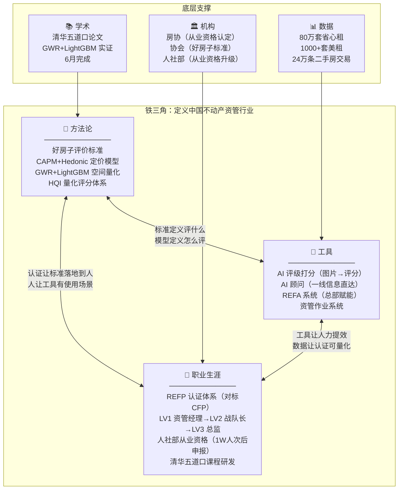
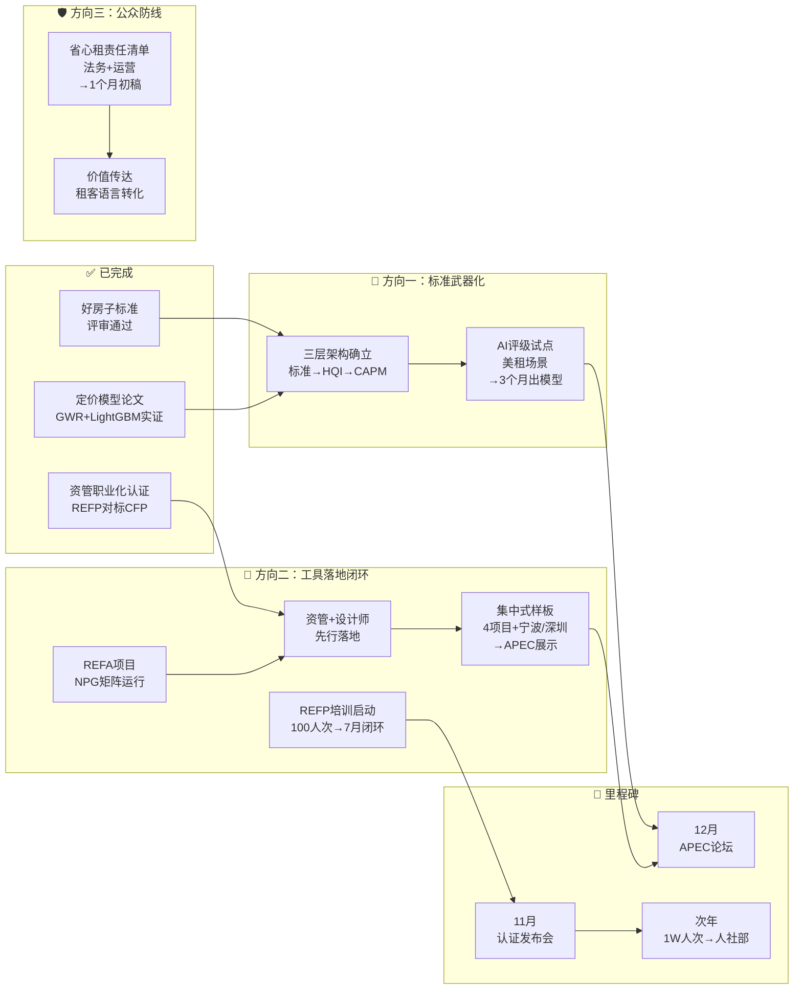

# 租赁好房子 · 评审通过后汇报框架

## 汇报背景

2025年推动的"租赁好房子"行业标准项目，今日与黄老师赴协会完成评审，**已获通过**。

这一成果的战略意义：贝壳获得了住房租赁行业"什么是好房子"的**定义权**——这是行业基础设施级别的卡位，后续所有业务动作都应围绕这一卡位展开。

**当前核心判断**：标准已立，但标准本身不产生价值。必须完成从"纸面标准"到"业务武器"的转化，否则评审通过只是里程碑，不是终点。

## 图1：铁三角全景图（战略层）

> **职业生涯 + 方法论（行业标准+定价模型+人社部认定）+ 工具（AI）= 铁三角**



**铁三角的逻辑闭环**：
- 方法论 → 工具：标准定义"评什么"，定价模型定义"怎么评"，AI工具有了锚点
- 工具 → 职业生涯：AI让人力提效，数据让认证可量化，不再依赖"老师傅经验"
- 职业生涯 → 方法论：认证让标准落地到人，人让工具有使用场景
- **没有方法论，工具是盲的；没有工具，方法是空的；没有认证，人没有动力按标准做事**
## 图2：落地路径图（执行层·三方向）



### 资管职业化认证时间线（已有详细规划）

| 时间 | 里程碑 | 状态 |
|------|--------|------|
| 12月（去年） | 组建标准委员会（清华五道口+房协+银行） | ✅ 完成 |
| 5月（本月） | 课程研发完成（REFP大纲，对标CFP体系） | ✅ 完成 |
| 6月 | 定价模型论文完成（CAPM+Hedonic+GWR+LightGBM） | 🔄 进行中 |
| 6月 | 备选认证培训机构确认（清华五道口学院） | 🔄 进行中 |
| 7月 | 100人次培训+考试闭环 | 🎯 下一步 |
| 9月 | 推广到其他企业（平安不动产、上海银行、福州安住） | 📋 计划中 |
| 11月 | 认证发布会（联合人民日报、新华网） | 📋 计划中 |
| 次年12月 | 1W人次认证后 → 申请人社部从业资格 | 📋 终极目标 |

### 定价模型：从学术到业务的关键桥梁

GWR+LightGBM论文的实战意义：

| 层面 | 学术模型 | 业务转化 |
|------|---------|---------|
| **特征价格（Hedonic）** | 量化各变量对房价的边际效应 | → 资管经理给业主做定价方案的**底层逻辑** |
| **空间异质性（GWR）** | 同一变量在不同区域影响不同 | → 不同城市的差异化定价策略 |
| **精准预测（LightGBM）** | 融合空间特征的高精度预测 | → 资管作业系统中的**自动定价引擎** |
| **CAPM框架** | 投资回报率=无风险利率+风险溢价 | → 业主资产规划的**ROI计算**：托管/美化前后的CapM差值 |

> 这套模型直接支撑了REFP认证体系中"**核心理论基础**"的要求：认证标准需紧密贴合行业核心能力要求，CAPM定价模型就是这个理论基础。

---

## 方向一：标准武器化——从"纸面标准"到"可量化可定价的业务武器"

> 合并原方向①（好房子标准+HQI关系）与③（AI评级打分·美租应用）
> 核心逻辑：标准本身不产生价值，必须完成"定义好→量化好→定价好"的转化

### 核心问题

评审通过了，但标准怎么从"专家评价"变成"规模化可执行的武器"？

### 三层架构：定义好→量化好→定价好

| 层级 | 体系 | 回答 | 性质 | 颗粒度 | 场景 |
|------|------|------|------|--------|------|
| **顶层** | 好房子评价标准 | "什么是好" | 行业标准（对外），协会背书 | 原则性、框架性 | APEC论坛、白皮书 |
| **中层** | HQI | "有多好" | 内部质量评分（对内） | 可量化、可打分 | 内部质量管理 |
| **底层** | CAPM+Hedonic定价模型 | "值多少钱" | 学术模型→业务引擎 | 可定价、可预测 | 资管作业系统、业主资产规划 |

> 锦江合作会议中明确提到："除了写定义之外，还是要有认证体系来支撑"——行业标准必须配套可量化的认证体系才有落地价值，HQI+定价模型就是这个认证体系的量化引擎。

**关键论点**：三层架构形成完整闭环。竞争对手即使抄了标准，也抄不走HQI的评分体系和24万条数据训练的定价模型。

### AI评级：三层架构的关键桥梁

AI评级解决了标准从"中层量化"到"规模化执行"的最后一公里：

```
传统路径：专家现场打分 → 成本高、覆盖窄、不可规模化
AI路径：   拍照上传 → AI识别+评分 → 自动出报告 → 成本趋零、全覆盖
```

**三层架构与AI评级的衔接**：
- 好房子标准定义了**评什么**（舒适+科技+绿色三大维度）
- HQI提供了**评分框架**（可量化的打分体系）
- AI评级实现了**规模化执行**（拍照→自动评分→出报告）

### 美租场景：AI评级的最佳试点

- 美租已有1000+套装修房源的数据沉淀，是省心租大资产中"**最掐尖**"部分，信用风险近国债级
- 美租核心能力四要素：**渠道/产品/交付/供应链**——AI评级直接赋能"产品"和"交付"
- 已有决策："**行业标准需建立基准锚，如三星房溢价15%、五星溢价30%**"——AI评级为这个基准锚提供量化验证

**演示场景**：美租房源上线前拍照 → AI按好房子三维度（舒适+科技+绿色）自动打分 → 评分纳入房源展示 → 租客可直观看到"好房指数"

**数据壁垒**：贝壳80万套省心租+1000+套美租的实拍图片+入住后反馈，是训练AI评级模型的**独家数据资产**——竞争对手无法复制

**延伸可能**：AI评级不仅用于美租，还可用于：
- 省心租全量房源分级
- 业主定价建议（好房子指数→租金溢价）
- 金融机构风控参考（好房子评分→资产质量评估）

### CAPM+Hedonic定价模型：让"好"可以定价

GWR+LightGBM论文的实战意义——三层架构的底层引擎：

| 层面 | 学术模型 | 业务转化 |
|------|---------|---------|
| **特征价格（Hedonic）** | 量化各变量对房价的边际效应 | → 资管经理给业主做定价方案的**底层逻辑** |
| **空间异质性（GWR）** | 同一变量在不同区域影响不同 | → 不同城市的差异化定价策略 |
| **精准预测（LightGBM）** | 融合空间特征的高精度预测 | → 资管作业系统中的**自动定价引擎** |
| **CAPM框架** | 投资回报率=无风险利率+风险溢价 | → 业主资产规划的**ROI计算** |

> ⚠️ 5月6日会议已识别风险：团队对省心租价值主张担心是"一厢情愿"——AI评级如果也停留在"自说自话"层面，会同样踩坑。**必须用外部验证（租客行为数据、复租率、租金溢价）校准AI评分**，不能用内部数据自证。

## 方向二：工具落地闭环——从AI工具到先行人群到项目验证

> 合并原方向②（REFA/AI顾问+总部赋能）、④（集中式样板项目）、⑤（资管+设计师先行）
> 核心逻辑：REFA(NPG)→先行人群(资管+设计师)→样板项目(集中式)，是一条完整的落地链

### 核心问题

铁三角的"工具"维度如何从概念变成现实？先在谁身上用？用什么项目验证？

### 第一环：REFA项目——工具维度的核心基础设施

**痛点**（上海/成都反复讨论，通用度0.95）：

> **"一线信息经过多层传递后失真严重，决策者必须直接接触业主和经纪人"**

```
传统路径：一线 → 资管 → 总监 → 总部（信息层层衰减）
REFA路径：一线 → AI实时抓取 → 结构化呈现 → 总部直接触达
```

REFA的两个核心能力：
1. **AI顾问**：AI代替多层管理者，直接从一线会议录音、聊天记录、业务系统中提取结构化信息
2. **总部赋能**：总部基于AI提炼的一手信息，做出更精准的决策，再通过AI工具将决策精准推送到一线

### NPG矩阵——REFA的核心模块

REFA的运作不是简单的"AI分析录音"，而是一个**三层分工的协同系统**：

```
┌─────────────────────────────────────────────────────┐
│                    NPG 矩阵                          │
├──────────┬──────────────────┬───────────────────────┤
│          │ 输入             │ 输出                   │
├──────────┼──────────────────┼───────────────────────┤
│ N 一线   │ 🎙️ 录音          │ 原始业务信号           │
│ (Needs)  │ 一手信息直采      │ 业主对话/业主诉求/现场 │
├──────────┼──────────────────┼───────────────────────┤
│ P 总监   │ 🔄 复盘+做实验    │ 管理判断/策略调整       │
│ (Process)│ 基于AI提炼的信息  │ 验证假设/修正动作      │
├──────────┼──────────────────┼───────────────────────┤
│ G 总部   │ 🔬 研发领域包     │ 标准化工具/方法论输出   │
│ (Global) │ 跨城市数据聚合    │ 知识产品/认证课程素材   │
└──────────┴──────────────────┴───────────────────────┘
```

| 层级 | 角色 | 做什么 | 不做什么 | 界面示例 |
|------|------|--------|---------|---------|
| **N 一线** | 信号采集器 | 负责录音，把真实业务场景完整记录 | 不做分析、不做判断、不提炼 | 录音界面：会议录音→AI自动转写→结构化提取业主诉求/痛点/异议 |
| **P 总监** | 实验室 | 基于AI结构化输出做复盘，设计实验验证假设 | 不做原始信息采集、不做标准化产品 | 实验界面：基于N层信号，设计A/B实验→追踪结果→修正策略 |
| **G 总部** | 研发中心 | 聚合多城市数据，研发领域包和标准化工具 | 不替一线录音、不替总监做判断 | 领域包界面：跨城市数据聚合→提炼可复制的知识包→输出认证课程素材 |

**NPG与铁三角的映射**：

```
NPG矩阵                    铁三角
─────────                   ──────
N 一线录音 ──────────────→ 工具（AI）的数据入口
P 总监复盘+实验 ────────→ 方法论（好房子标准/HQI）的迭代引擎
G 总部研发领域包 ────────→ 职业生涯（REFP认证）的课程素材来源
```

**领域包的含义**：总部从N层采集+P层验证的数据中，提炼出不同业务领域（如"业主资产规划""租客价值匹配""设计师认证"）的标准化知识包。领域包是NPG的终端产品——它将一线录音中反复出现的业务模式（N层）+总监实验验证的策略有效成分（P层），封装为可复制、可培训、可认证的标准化模块。这些领域包直接成为REFP认证课程的素材，也是AI评级模型的训练数据。

> 上海汇聚AI项目的已有进展：2026年为上海汇聚AI元年，5月1日正式启动，计划实现2-3个AI提效场景。已确定的工具栈：飞书会议纪要+待办、舆情爬虫、参数化看板/PPT。

### 第二环：先行人群——资管+设计师

铁三角体系不能一步到位，**资管经理和设计师**是最小可行落地场景：

**资管经理** → AI工具先行：
- 整装业务流程中已暴露：资管经理下单常出错，不了解业务细节，靠二三四手信息做判断
- 已有决策："**资管经理必须走分工路线，引入租户管家分担物业交付等事务**"
- REFA项目的AI顾问能力，首先解决资管经理的**信息不对称**问题
- AI直接推送一线信息给资管经理 → 下单准确率提升 → 业务效率提升

**设计师** → 认证体系先行：
- 已有共识轨迹："**如何解决'贝壳美租认证设计师'认证资质与发放权限问题**"（共识度1.00）
- 设计师需要行业认证 → 好房子标准+人社部认定提供方法论 → AI工具提供评级验证能力
- "贝壳美租认证设计师"工牌能提高客户信任度——这是**认证体系的最小可行产品**

**落地路径**：

```
第一步：资管经理 → AI工具先行
  REFA → AI直接推送一线信息 → 解决信息衰减
  上海汇聚已有基础：租务管家工作量与效率AI工具、每日排名与效率提示

第二步：设计师 → 认证体系先行
  "贝壳美租认证设计师" → 好房子标准为考核内容 → HQI为评分工具
  认证工牌作为信任载体 → 设计师有职业发展路径 → 标准真正落地到人

第三步：两者交汇
  资管用AI评级验收设计师装修质量 → 设计师用AI工具获取装修建议
  → 形成"人+标准+工具"的闭环
```

**关键论点**：资管+设计师恰好覆盖铁三角三个维度——AI工具（资管用）、方法论/标准（设计师考核依据）、职业生涯（设计师认证体系）。

### 第三环：集中式样板项目——用真实验证

标准需要"样板间"，集中式项目是**最小可行验证单元**。

**已有储备**：

| 储备资源 | 详情 | 状态 |
|---------|------|------|
| **杭州萧山·星辉时光城** | 国企闲置资产盘活首个项目，3939间（毛坯90%），包干委托运营 | 📄 决策会已开 |
| **南京浦口·城市星瀚** | 5+5年委托运营，江北CBD商圈，激励服务费与出租率挂钩 | 📄 合作方案已完成 |
| **上海虹桥·近铁中心** | FAM模式，200间，装改1816万，贝壳海盐公寓品牌 | 📄 合作方案已完成 |
| **上海·呈元驿大厦** | 项目资料已备，上海补充样本 | 📄 资料已备 |
| **美租信托资金结构** | 承接池+放款池双池，优先75%/劣后25%，累计3期/1亿规模 | ✅ 运行中 |
| **宁波/深圳国企房源** | 宁波北仑城投+深圳国企以旧换新/工抵房房源对接 | 🔄 对接中 |
| **APEC平行论坛** | 一个行业标准+一场APEC论坛+清华白皮书+分散式和集中式项目 | ✅ 承诺中 |

> 📎 详见 [[集中式项目支撑材料/集中式项目概览]]

**样板逻辑**：4个已签约项目 + 2个城市对接中（宁波/深圳），覆盖三种合作模式，形成**建造验证+运营验证+金融闭环验证**的完整矩阵

| 维度 | 杭州星辉时光城 | 南京城市星瀚 | 上海近铁中心 |
|------|--------------|------------|------------|
| **政策卡位** | 闲置资产盘活首个项目（80万方入口） | 保租房政府合作平台（住建部背书） | 城市更新+集体资产保值增值 |
| **合作模式** | 包干委托运营 | 委托运营 | **FAM模式**（装修+运营+金融） |
| **好房子验证** | 毛坯→按标准装修（**建造验证**） | 长期运营中持续评级（**运营验证**） | 装改→信托→回收（**金融闭环验证**） |
| **经济效益** | 6-8%净利率 | 5%+激励 | 年毛利817万，26个月回收 |
| **社会效益** | 国企闲置资产盘活标杆→可复制全省 | 政府保租房平台合作→可复制全国 | 商办转型+就业配套 |
| **铁三角验证** | 方法论（标准落地装修） | 工具（AI评级+数据） | 工具×方法论（FAM=标准+金融闭环） |

**为什么是集中式而不是分散式**：
- 集中式项目业主单一（国企/政府）→ 改造可控
- 数据采集标准化 → AI评级模型训练质量高
- 外部展示效果好 → 可邀请行业参观、APEC论坛展示

**金融闭环**：样板项目同时验证"好房子标准 → 更高租金溢价 → 更优资产质量 → 更低融资成本"的金融逻辑，这与美租信托、租金代扣分期的资金结构天然衔接

### 三环闭环的逻辑

```
REFA(NPG)        先行人群           样板项目
  ↓                ↓                 ↓
AI工具解决       资管用AI工具        杭州毛坯→建造验证
信息衰减         设计师用认证体系     南京运营→运营验证
                 最小可行场景        上海FAM→金融闭环验证
  ↓                ↓                 ↓
  └─────── 三环咬合 ───────┘
  工具让人有力 → 人让标准落地 → 项目验证闭环
```

> ⚠️ 两个关键风险：(1) 上海汇聚AI项目中永邦宏观叙事 vs 王丽要求的落地画面感——汇报必须给**具体场景**，如"资管经理每天收到AI推送的3条关键房源状态变化"；(2) 美租scope中开放问题排名第一的是"消费者心里到底觉得我在买什么"——样板项目必须同步做消费者验证，不能做成"自嗨工程"。

### REFP认证体系详解（已有详细规划）

**对标体系**：CFP（国际金融理财师）课程体系

| CFP 课程 | REFP 对应模块 |
|---------|-------------|
| 投资规划 | 不动产投资规划（CAPM+Hedonic定价） |
| 员工福利与退休规划 | 业主资产规划（租vs卖、装vs不装、全款vs分期） |
| 个人税务与遗产筹划 | 不动产税务规划 |
| 个人风险管理与保险规划 | 资产风险对冲 |
| 综合案例分析 | 不动产资产规划综合案例 |

**分层认证**：

| 级别 | 角色 | 规模 | 深度 | 核心能力 |
|------|------|------|------|---------|
| LV1 | 资管经理 | 单房 | 数据展示 | 收房问题点检查、定价方案 |
| LV2 | 战队长 | 多套房 | 定价工具使用 | 托管&美化收益比较、美化方案 |
| LV3 | 资管总监 | 区域市场 | 方案能力 | ROI=CapM(after)-CapM(before) /（托管费+装配成本） |

**核心公式**：`ROI = [CapM(after) - CapM(before)] / (托管费 + 装配成本)`
——这是整个认证体系的理论根基，直接来自CAPM模型

**考培分离机制**（学习CFP）：
- 考试：由标准委员会组织
- 培训：由认证服务机构完成（清华五道口学院）
- 课程研发：持续迭代，社群化运营（参照CFA协会）

## 方向三：公众防线——责任界定与价值传达

> 原方向⑥独立保留，但重新定位为"防线"——先守住底线，再谈上限
> 这是面向公众的独立议题，不能并入铁三角叙事

### 核心问题

公众怎么感知省心租的价值？出了事谁负责？

### 最务实、最紧迫的方向

**责任界定（底线·雷区）**：
- 当前省心租模式"大包大揽"（含维修/招租/催缴），管理费双向各收10%
- 一旦出现燃气事故、电器故障致人伤亡等极端事件，**有限责任边界的模糊会让贝壳承担无限风险**
- 需要清晰界定：哪些是物业/燃气公司责任，哪些是用户自身责任，哪些是贝壳管理责任

**价值传达（上限）**：
- 省心租80万套规模（全球第一），但净利率5%以下——规模大但利润薄
- 5月6日会议已识别核心痛点：团队提炼了五六句价值主张，但担心是"**一厢情愿**"
- 舒适+科技+绿色三支柱需要**用租客语言**而不是专家语言传达

### 汇报建议

**责任界定**（先讲·底线）：推动制定**"省心租管理责任清单"**

| 责任归属 | 示例 |
|---------|------|
| **贝壳管理责任** | 招租时效、租金代扣、日常维修响应 |
| **物业/燃气公司责任** | 燃气管道、电梯维保、公共区域安全 |
| **用户自身责任** | 家电使用不当、人为损坏、违规改造 |

**价值传达**（后讲·上限）：把"舒适+科技+绿色"转化为**租客可感知的承诺**

| 支柱 | 专家语言 | 租客语言 |
|------|---------|---------|
| 舒适 | 好房子评价标准达标 | "住进来不满意7天可退" |
| 科技 | AI智能匹配 | "3分钟匹配最适合你的房子" |
| 绿色 | ENF级环保材料 | "装修材料检测报告扫码可查" |

> ⚠️ **优先级判断**：责任界定比价值传达更紧急——一个燃气事故的舆论风险可以抵消所有品牌建设。

## 汇报结构建议

```
开场（3分钟）
  评审通过 → 战略卡位已成
  核心框架：铁三角（职业生涯+方法论+工具）
  关键判断：标准已立，现在必须从"标准"走向"落地"

第一部分 · 标准武器化（7分钟）
  三层架构：好房子标准+HQI+CAPM定价 → "定义好→量化好→定价好"
  AI评级：三层架构的规模化执行桥梁，美租场景试点
  → 核心论点：我们有权定义好，也能量化好

第二部分 · 工具落地闭环（8分钟）
  第一环：REFA(NPG)→AI顾问+总部赋能，解决信息衰减
  第二环：资管+设计师先行→最小可行落地场景
  第三环：集中式样板项目→用真实验证标准
  → 核心论点：工具让人有力→人让标准落地→项目验证闭环

第三部分 · 公众防线（5分钟）
  责任界定（底线）→ 价值传达（上限）
  → 核心论点：先守住底线，再谈上限

收尾（2分钟）
  请求领导决策的四件事
  下一步行动
```

## 请求领导决策事项

### 必须拍板（4项）

1. **批准2-3个集中式样板项目立项**
   - 建议优先：宁波/北仑/南京浦口城投已有对接的房源
   - 6个月内完成装修+入住+AI评级验证
   - 作为APEC论坛展示案例

2. **批准AI评级工具在美租场景的试点**
   - 以美租1000+套房源为训练集
   - 与好房子三大支柱（舒适+科技+绿色）对齐
   - 融合GWR+LightGBM定价模型的特征工程
   - 目标：3个月内出第一版AI评级模型

3. **批准启动省心租管理责任清单制定**
   - 法务+运营+品宣联合制定
   - 逐项标注责任归属、赔偿上限、免责条款
   - 1个月内完成初稿

4. **确认铁三角体系推进路径与REFP认证时间线**
   - 方法论：好房子标准+HQI+CAPM定价模型三层架构确认
   - 工具：REFA项目+AI评级工具+资管作业系统并进
   - 职业生涯：按REFP时间线推进（7月100人次考试→11月发布会→次年人社部申报）
   - 落地顺序：资管经理（AI工具先行）→ 设计师（认证体系先行）→ 两者交汇

### 需要确认但不必当天决定（2项）

5. **好房子标准与HQI+定价模型的关系是否采用"三层架构"定位**
   - 定义好 → 量化好 → 定价好
   - 影响AI评级工具和资管作业系统的设计方向

6. **省心租价值传达是否从"舒适+科技+绿色"转为租客可感知的承诺语言**
   - 需要品宣+业务对齐
   - 建议先用A/B测试验证哪种表达更有效
