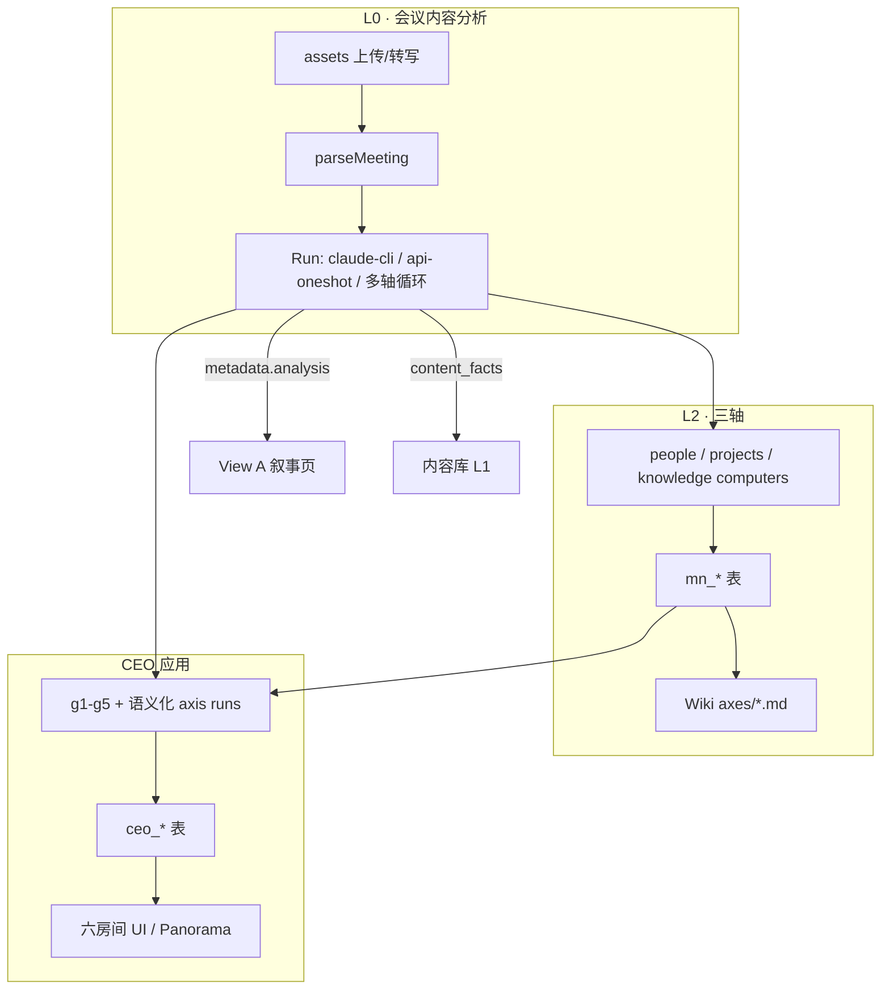
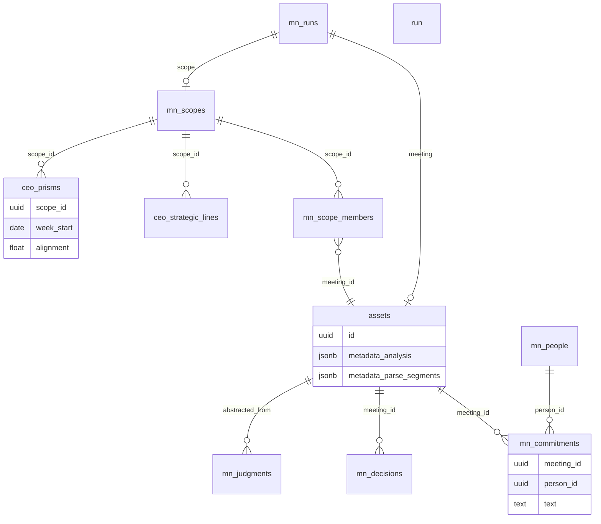

# 会议分析 · 三轴 · CEO 应用：Prompt 与数据关系

> 版本：2026-05-17  
> 代码锚点：`api/src/modules/meeting-notes/`、`api/src/modules/ceo/`、`webapp/src/prototype/meeting/`、`webapp/src/prototype/ceo/`

本文档说明三块能力各自的 **LLM Prompt 来源**、**持久化表/字段**、以及 **上下游数据依赖**。三块是流水线关系：会议分析产出原材料与可读纪要 → 三轴结构化落库 → CEO 在 scope/周维度聚合为决策驾驶舱。

---

## 1. 总览



| 模块 | 主要 Prompt 入口 | 主要落库 | 消费方 |
|------|------------------|----------|--------|
| 会议内容分析 | `claudeCliFullPipeline.ts` / `oneshotRunner` / `composeAnalysis` | `assets.metadata.*`、`content_facts`、Wiki 会议页 | 会议详情 View A、三轴 computers、CEO `loadPromptCtx` |
| 三轴 | 各 `axes/*/*Computer.ts` + 可选 `decoratorStack` | `mn_*`（22 子维度） | 轴页面、纵向分析、Wiki 聚合、CEO prompts |
| CEO 应用 | `ceo/prompts/*` + `runHandlers` g1–g5 | `ceo_*` + `ceo_prisms` | `/api/v1/ceo/*`、六棱镜全景 |

**统一运行表**：会议分析与 CEO 任务都记入 `mn_runs`（`module='meeting_notes'` 或 `module='ceo'`），通过 `axis` 字段区分任务类型。

---

## 2. 会议内容分析（Meeting Notes · 单场）

### 2.1 职责边界

- **L0 解析**（`parseMeeting`）：不跑大模型综合分析，只做转写分段、参会人归并、事件 `mn.meeting.parsed`。
- **完整分析 Run**：一次或多次 LLM，产出 **可读 ANALYSIS**、**结构化 axes JSON**、**facts**、**Wiki Markdown**。

### 2.2 流水线步骤与 Prompt

| 步骤 ID | 标签（前端） | Prompt / 逻辑 | 输出写入 |
|---------|--------------|---------------|----------|
| `ingest` | 原始素材解析 | `parseMeeting` → `assetsAi.parseMeeting`（ASR/清洗） | `assets.metadata.parse_segments`、`mn_people` |
| `segment` | 参与者归并 | `participantExtractor` | `assets.metadata.participants` |
| `dispatch` | 专家 + 策略链 | `buildDispatchPlan` + `expertProfileLoader`（专家 persona 片段） | `mn_runs.metadata.dispatchPlan` |
| `dec` | LLM 调用 | 见下方「主 Prompt」 | 原始 JSON |
| `synth` | JSON 校验 | schema 修复（`normalizeCliOutput`） | 内存对象 |
| `render` | 持久化 | `persistClaudeAxes` / `persistClaudeFacts` / `persistClaudeWiki`、`composeAnalysis` | 见 2.3 |

**主 Prompt（claude-cli / api-oneshot 一次出全量）**

| 文件 | 作用 |
|------|------|
| `runs/promptTemplates/claudeCliFullPipeline.ts` | 拼装整段 prompt：`ANALYSIS_SCHEMA_SPEC`、`AXES_SCHEMA_SPEC`、`facts`、`wikiMarkdown`、装饰器片段、专家按轴裁剪的 persona、few-shot |
| `runs/claudeCliRunner.ts` | `spawn claude -p`，解析 `{ meeting, participants, analysis, axes, facts, wikiMarkdown }` |
| `runs/oneshotRunner.ts` | 同上拓扑，走 `deps.llm.completeWithSystem`（`MN_ONESHOT_MODEL` 等） |
| `runs/promptTemplates/claudeCliScope.ts` | scope 级第二次 session（project/client/topic） |

**装饰器（写入 prompt 的指令片段，与 runtime 对齐）**

定义于 `claudeCliFullPipeline.ts` 的 `DECORATOR_FRAGMENTS`，与 `axes/decoratorStack.ts` 的 `DECORATOR_INSTRUCTIONS` 语义对应，例如：

- `evidence_anchored` — 结论必须锚定原文 `who:「quote」`
- `calibrated_confidence` — 字段附 confidence 0–1
- `rubric_anchored_output` — 严格 schema 枚举
- `debate` — tension/consensus 必须呈现分歧矩阵
- `mental_model_rotation` — 至少 2 个思维模型审视同一议题

策略链来自 enqueue 时的 `strategySpec`（`|` 分隔），由 `dispatchPlan.decoratorStack` 展示。

**多轴循环模式（非 claude-cli 一次出）**

- 各子维度由 `axes/registry.ts` → `*Computer.ts` 独立调 LLM（见第 3 节）。
- Run 结束后 `composeAnalysis.ts` 将 `mn_*` 行 **schema-map** 为 `AnalysisObject`，写入 `assets.metadata.analysis`（零额外 LLM）。

### 2.3 产出物与数据表

#### A. 原材料（parse 层）

| 产出 | 存储位置 | 说明 |
|------|----------|------|
| 转写分段 | `assets.metadata.parse_segments` | `{ count, truncated, segments[] }`，单段含 speaker/start/text |
| 参会人 | `mn_people` + `assets.metadata.participants` | 按姓名归一化去重 |
| 运行痕迹 | `mn_runs` | `mode`、`progress_pct`、`metadata.dispatchPlan` 等 |

#### B. 可读分析（ANALYSIS · View A）

写入 `assets.metadata.analysis`，schema 与 `runs/composeAnalysis.ts` / `_fixtures.ts` 对齐：

| 字段 | 含义 |
|------|------|
| `summary.tldr` | ≤50 字核心结论 |
| `summary.scqa` | 金字塔 SCQA 四段 |
| `summary.metrics` | 议题数/决议数/开放问题/长期未决/必要性 verdict |
| `summary.decision` | 主决议短文 |
| `summary.actionItems[]` | `{ id, who, what, due }` |
| `summary.risks[]` | 风险条目 |
| `tension[]` | 张力：双方、强度、moments 原话 |
| `newCognition[]` | 信念更新 before/after/trigger |
| `focusMap[]` | 每人关注主题 |
| `consensus[]` | 共识/分歧项 |
| `crossView[]` | 主张—回应链 |
| `_generated` | `{ by, runId, at, phase }` 区分自动/手工 |

#### C. 结构化事实与 Wiki

| 产出 | 存储位置 |
|------|----------|
| SPO 三元组 | `content_facts`（含 `taxonomy_code`） |
| 会议 Wiki 页 | `data/content-wiki/.../sources/meeting/<slug>/_index.md` |
| 实体增量 | `wikiMarkdown.entityUpdates` → content-wiki 实体/概念文件 |

#### D. 与三轴的关系

- **claude-cli/oneshot**：LLM 一次输出 `axes` JSON → `persistClaudeAxes` 批量写入 `mn_*`。
- **多轴模式**：同一 ANALYSIS 所需字段由 axes 表事后合成（`composeAnalysis`）。

---

## 3. 三轴（人物轴 · 项目轴 · 知识轴）

### 3.1 注册表

单一来源：`api/src/modules/meeting-notes/axes/registry.ts`（前端镜像：`webapp/src/prototype/meeting/_axisRegistry.ts`）。

| 轴 | stage | 子维度数 | 消费源 |
|----|-------|----------|--------|
| `people` | L2 | 6 | 会议原材料、历史纪要 |
| `projects` | L2 | 6 | 会议原材料、历史纪要 |
| `knowledge` | L2 | 10 | 会议原材料、历史纪要、**专家库**、**内容库 assets** |

> 注：`meta` / `tension` 已合并进 `people`（情绪曲线、张力）与 `projects`（决策质量、必要性），`AXIS_SUBDIMS.meta/tension` 为空数组，仅作旧 run 兼容。

### 3.2 子维度 → Computer → 表

| 轴 | subDim | Computer 文件 | 主表 |
|----|--------|---------------|------|
| people | commitments | `people/commitmentsComputer.ts` | `mn_commitments` |
| people | role_trajectory | `people/roleTrajectoryComputer.ts` | `mn_role_trajectory_points` |
| people | speech_quality | `people/speechQualityComputer.ts` | `mn_speech_quality` |
| people | silence_signal | `people/silenceSignalComputer.ts` | `mn_silence_signals` |
| people | affect_curve | `meta/affectCurveComputer.ts` | `mn_affect_curve` |
| people | intra_meeting | `tension/tensionComputer.ts` | `mn_tensions` |
| projects | decision_provenance | `projects/decisionProvenanceComputer.ts` | `mn_decisions` |
| projects | assumptions | `projects/assumptionsComputer.ts` | `mn_assumptions` |
| projects | open_questions | `projects/openQuestionsComputer.ts` | `mn_open_questions` |
| projects | risk_heat | `projects/riskHeatComputer.ts` | `mn_risks` |
| projects | decision_quality | `meta/decisionQualityComputer.ts` | `mn_decision_quality` |
| projects | meeting_necessity | `meta/meetingNecessityComputer.ts` | `mn_meeting_necessity` |
| knowledge | reusable_judgments | `knowledge/reusableJudgmentsComputer.ts` | `mn_judgments` |
| knowledge | mental_models | `knowledge/mentalModelsComputer.ts` | `mn_mental_model_invocations` |
| knowledge | cognitive_biases | `knowledge/cognitiveBiasesComputer.ts` | `mn_cognitive_biases` |
| knowledge | counterfactuals | `knowledge/counterfactualsComputer.ts` | `mn_counterfactuals` |
| knowledge | evidence_grading | `knowledge/evidenceGradingComputer.ts` | `mn_evidence_grades` |
| knowledge | model_hitrate | `knowledge/modelHitrateComputer.ts` | `mn_model_hitrates` |
| knowledge | consensus_track | `knowledge/consensusTrackComputer.ts` | `mn_consensus_tracks` |
| knowledge | concept_drift | `knowledge/conceptDriftComputer.ts` | `mn_concept_drifts` |
| knowledge | topic_lineage | `knowledge/topicLineageComputer.ts` | `mn_topic_lineage` |
| knowledge | external_experts | `knowledge/externalExpertsComputer.ts` | `mn_external_experts` |

**串行依赖**（同轴内）：`knowledge` 的 `evidence_grading`、`concept_drift` 在 phase-2 执行（依赖 `mn_assumptions` / `mn_mental_model_invocations`）。`projects/decision_provenance` 会预加载 scope 历史决策链。

### 3.3 轴级 Prompt 模式

每个 Computer 通常包含：

1. **SYSTEM** 字符串（任务说明 + JSON 形状 + `axes/_examples.ts` few-shot）
2. **USER** 按 chunk 拼接：`会议标题 + 正文第 k/n 段`（`extractListOverChunks` / `chunkedContent`）
3. **Runtime 装饰**：`callExpertOrLLM` 读取 `strategyStorage` 中的 `decoratorStack` + `expertPersonaByAxis`

示例（承诺抽取）— `commitmentsComputer.ts`：

```text
SYSTEM: 你是会议纪要承诺抽取器… 返回 JSON 数组 [{who, text, due_at, state, progress}]…
USER:   会议标题：… 正文（第 1/3 段）：…
```

专家分派（多轴循环模式）— `dispatchPlan.ts`：

- 角色 `people` / `projects` / `knowledge` 各绑定 1–N 位专家（`expertRoles`）
- 未指定时用虚拟专家：`expert-people-analyst`、`expert-decision-strategist`、`expert-knowledge-synthesizer`

### 3.4 产物标签（panorama / UI）

由 `AXIS_REGISTRY[].produces` 聚合（`ALL_PRODUCES`）：

**人物轴**：承诺清单、角色轨迹、发言图谱、沉默信号、情绪热力图、张力清单  

**项目轴**：决策链、假设清单、开放问题、风险热度、会议健康度报告、一页纸摘要  

**知识轴**：心智模型命中、互补专家组、盲区档案、Rubric 矩阵、心智模型命中率、共识轨迹、概念漂移、议题谱系、外部专家注释  

### 3.5 Wiki 物化

`wiki/meetingAxesGenerator.ts` 跨会议聚合 `mn_*` →  

`data/content-wiki/.../sources/meeting/axes/{people-人物|projects-项目|knowledge-知识}/<中文文件名>.md`

### 3.6 跨轴与纵向

| 机制 | 表/服务 | 触发 |
|------|---------|------|
| 跨轴链接 | `mn_cross_axis_links` | `mn.run.completed` → `CrossAxisLinkResolver` |
| 信念漂移 / 决策树 | `mn_belief_drift_series`、`mn_decision_tree_snapshots` | scope 级 run 完成 → `LongitudinalService` |
| 版本快照 | `mn_axis_versions` | 轴重算时 `VersionStore` |

---

## 4. CEO 应用（决策驾驶舱）

### 4.1 两层任务模型

| 层级 | 命名 | 说明 |
|------|------|------|
| **Legacy 步骤组** | `g1`–`g5` | Panorama 时间轴五步；`runHandlers.ts` 内联或委托 MN |
| **语义化 axis** | `compass-stars`、`boardroom-rebuttal` 等 | `ceo/prompts/*` + zod 校验 + `promptHandlers.ts` |

入队：`CeoEngine.enqueueRun({ axis, scopeId, workspaceId, metadata })` → `mn_runs`（`module='ceo'`）。

### 4.2 g1–g5 与数据写入

| 步骤 | 标签 | Prompt/逻辑 | 写入表 |
|------|------|-------------|--------|
| **g1** | ASR & 实体 | 委托 `meetingNotes.enqueueRun`（需 `metadata.targetMeetingId`） | 复用 MN parse/ingest |
| **g2** | 评分 & 信念 | 5 维 Rubric LLM（战略清晰/节奏/透明/严谨/回应） | `ceo_rubric_scores` |
| **g3** | 矛盾 & 专家 | `metadata.kind`: `g3-rebuttal` → 反方演练；`g3-sandbox` → 兵棋 | `ceo_rebuttal_rehearsals`、`ceo_sandbox_runs` |
| **g4** | 跨会 & 批注 | `echo` / `boardroom-annotations` / `balcony-prompt` 分流 | `ceo_strategic_echos`、`ceo_boardroom_annotations`、`ceo_balcony_reflections` |
| **g5** | 棱镜聚合 | **无 LLM**，六房间 aggregator 规则计算 | `ceo_prisms`（周快照） |

g5 指标来源：

| 棱镜 | 房间 | 计算函数 |
|------|------|----------|
| direction | Compass | `computeAlignmentScore` |
| board | Boardroom | `computeForwardPct` |
| coord | Tower | `computeResponsibilityClarity`（依赖 `mn_commitments`） |
| team | War Room | `computeFormationHealth` |
| ext | Situation | `computeCoverage` |
| self | Balcony | `computeWeeklyRoi` |

### 4.3 语义化 Prompt 一览

所有定义在 `api/src/modules/ceo/prompts/`，经 `PROMPTS` + `loadPromptCtx` 组装上下文。

| axis | Prompt 文件 | 典型写入表 |
|------|-------------|------------|
| `compass-stars` | `compass-stars.ts` | `ceo_strategic_lines` |
| `compass-drift-alert` | `compass-drift-alert.ts` | `ceo_strategic_echos` (fate=refute) |
| `compass-echo` | `compass-echo.ts` | `ceo_strategic_echos` |
| `compass-narrative` | `compass-narrative.ts` | 叙事类 echo/批注 |
| `boardroom-rebuttal` | `boardroom-rebuttal.ts` | `ceo_rebuttal_rehearsals` |
| `boardroom-annotation` | `boardroom-annotation.ts` | `ceo_boardroom_annotations` |
| `boardroom-concerns` | `boardroom-concerns.ts` | `ceo_director_concerns` |
| `boardroom-brief-toc` | `boardroom-brief-toc.ts` | `ceo_briefs.toc` |
| `boardroom-promises` | `boardroom-promises.ts` | `ceo_board_promises` |
| `situation-signal` | `situation-signal.ts` | `ceo_external_signals` |
| `situation-rubric` | `situation-rubric.ts` | `ceo_rubric_scores` |
| `balcony-prompt` | `balcony-prompt.ts` | `ceo_balcony_reflections` |
| `war-room-spark` | `war-room-spark.ts` | `ceo_war_room_sparks` |
| `war-room-formation` | `war-room-formation.ts` | `ceo_formation_snapshots` |
| `ceo-decisions-capture` | `ceo-decisions-capture.ts` | `ceo_decisions` |

**Prompt 上下文 `PromptCtx`**（`prompts/index.ts` → `loadPromptCtx`）从以下来源 JOIN：

| 字段 | 数据源 |
|------|--------|
| `meetings` | `mn_scope_members` ⋈ `assets` |
| `judgments` | `mn_judgments`（近 90 天） |
| `commitments` | `mn_commitments` ⋈ `mn_people` |
| `directors` | `ceo_directors` |
| `brief` | `ceo_briefs` (draft) |
| `strategicLines` | `ceo_strategic_lines` |
| `stakeholders` | `ceo_stakeholders` |
| `conceptDrifts` | `mn_concept_drifts` |
| `counterfactuals` | `mn_counterfactuals` |
| `topicLineages` | `mn_topic_lineage` |
| `consensusTracks` | `mn_consensus_tracks` |

**输出约束**（所有语义化 prompt 共用）：`JSON_ESCAPE_RULE` — 纯 JSON、禁止裸 ASCII 引号与真实换行、仅引用 ctx 内 ID/人名。

### 4.4 CEO 表与六房间

| 房间 | 核心表 |
|------|--------|
| Compass | `ceo_strategic_lines`、`ceo_strategic_echos`、`ceo_attention_alloc` |
| Boardroom | `ceo_directors`、`ceo_director_concerns`、`ceo_briefs`、`ceo_rebuttal_rehearsals`、`ceo_boardroom_annotations`、`ceo_board_promises` |
| Tower | `ceo_board_promises`、聚合 `mn_commitments` |
| War Room | `ceo_formation_snapshots`、`ceo_war_room_sparks`、`ceo_sandbox_runs` |
| Situation | `ceo_stakeholders`、`ceo_external_signals`、`ceo_rubric_scores` |
| Balcony | `ceo_balcony_reflections`、`ceo_time_roi` |
| 全景 | `ceo_prisms`、`ceo_prism_weights` |

API 聚合：`GET /api/v1/ceo/panorama`（`panorama/service.ts`）。

### 4.5 Panorama 源/产出声明

- **SOURCES**（`ALL_CONSUMES`）：会议原材料、历史纪要、专家库、内容库 assets  
- **OUTPUTS**（`ALL_PRODUCES` + `CEO_PRODUCES`）：三轴全部产物标签 + 转写、rehash 指数、外脑批注、六棱镜指标、一页纸摘要  

---

## 5. 跨模块数据关系图



**依赖顺序（推荐）**

1. 上传会议 → `parseMeeting`（L0）  
2. 触发 MN Run（claude-cli / oneshot / 多轴）→ `metadata.analysis` + `mn_*` + `content_facts`  
3. （可选）`MeetingAxesGenerator` → Wiki axes  
4. 绑定 `mn_scope_members`  
5. CEO `g1`（若需重新 ingest）→ 语义化 prompts（compass-stars → echo → …）→ `g5` 周聚合  

---

## 6. 配置与环境变量（摘录）

| 变量 | 影响 |
|------|------|
| `MN_ONESHOT_MODEL` / `ANTHROPIC_*` | 会议 oneshot / CLI 模型路由 |
| `MN_MIN_TRANSCRIPT_CHARS` | 最短转写门槛 |
| `MN_MULTIAXIS_TOKEN_STREAM` | 多轴 LLM 流式进度 |
| `CEO_WORKER_DISABLE` / `CEO_API_ONLY` | 只入队不消费 ceo runs |
| `CEO_SCHEDULER_DISABLE` | 关闭 g5 定时入队 |
| `CEO_DUMP_FAIL` | LLM JSON 失败时落盘 `/tmp/ceo-llm-fail-*` |

---

## 7. 相关文档与代码索引

| 文档/路径 | 内容 |
|-----------|------|
| `docs/ceo-app-deferred.md` | WarRoom 兵棋详情页、g1 真接等待项 |
| `api/docs/meeting-notes-external-api.md` | 会议模块对外 API |
| `axes/registry.ts` | 三轴注册表、produces/consumes |
| `runs/promptTemplates/claudeCliFullPipeline.ts` | 会议一次出全量 prompt |
| `runs/composeAnalysis.ts` | ANALYSIS schema-map |
| `ceo/prompts/index.ts` | CEO prompt 注册 + `loadPromptCtx` |
| `ceo/panorama/service.ts` | 全景画板聚合 |

---

## 8. 修订记录

| 日期 | 说明 |
|------|------|
| 2026-05-17 | 初版：会议分析 / 三轴 / CEO 的 prompt 与数据关系 |
